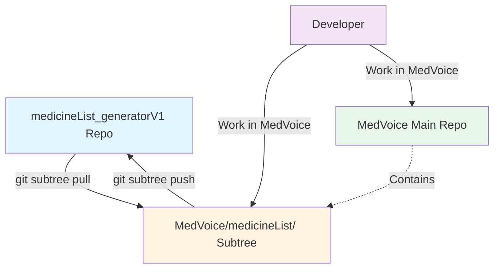
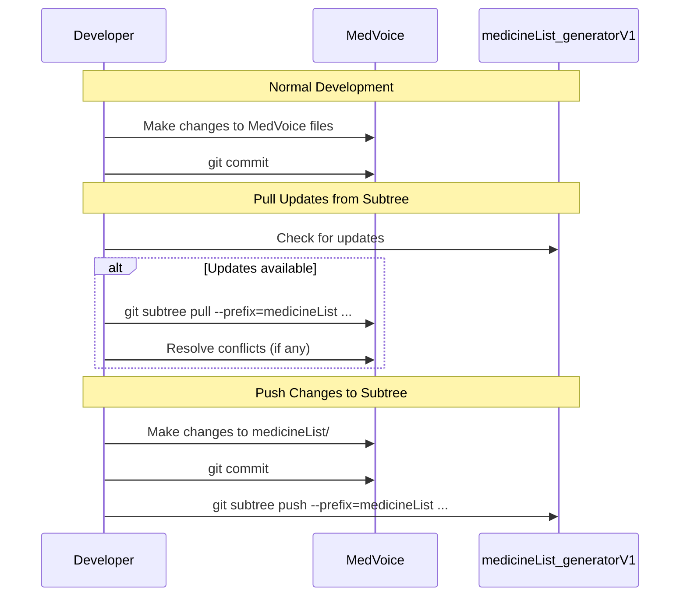

# Git Subtree Workflow: medicineList_generatorV1 Integration

## Overview

This document describes the Git Subtree integration between MedVoice and medicineList_generatorV1 repositories. The `medicineList_generatorV1` repository is integrated as a subtree in the `medicineList/` directory of the MedVoice repository.

### Repositories

| Repository | URL | Local Path | Purpose |
|------------|-----|------------|---------|
| **MedVoice** (Parent) | https://github.com/ThZihan/medVoice.git | `d:/projects/medVoice` | Main application repository |
| **medicineList_generatorV1** (Subtree) | https://github.com/ThZihan/medicineList_generatorV1.git | `medicineList/` | Medicine list generator submodule |

### Why Git Subtree?

- **Separate Histories**: Both repositories maintain their own git history
- **Bidirectional Sync**: Can pull updates from subtree and push changes back
- **Simpler than Submodules**: No need for `.gitmodules` file or extra initialization
- **Clean History**: Using `--squash` flag keeps the parent repo's history clean

---

## Workflow Diagram



---

## Initial Setup

### How the Subtree Was Added

The subtree was added on **2026-03-12** with the following command:

```bash
cd d:/projects/medVoice
git subtree add --prefix=medicineList https://github.com/ThZihan/medicineList_generatorV1.git master --squash
```

### What Was Created

| File/Directory | Description |
|----------------|-------------|
| `medicineList/` | Directory containing the entire medicineList_generatorV1 repository |
| Commit `9a37bed` | Squashed commit containing all medicineList_generatorV1 content |
| Commit `e694bdb` | Merge commit integrating the subtree |

### Git Log After Setup

```bash
$ git log --oneline
e694bdb Merge commit '9a37bed16a55d619034d635b37abc70b6c9b1c50' as 'medicineList'
9a37bed Squashed 'medicineList/' content from commit 64329f7
58defcb Initial commit: Add README
```

---

## Git Subtree Commands Reference

### 1. Adding a Subtree (Initial Setup)

Use this command to add a new subtree to your repository:

```bash
git subtree add --prefix=<directory> <repository-url> <branch> --squash
```

**Example:**
```bash
git subtree add --prefix=medicineList https://github.com/ThZihan/medicineList_generatorV1.git master --squash
```

**Parameters:**
- `--prefix=<directory>`: Directory where the subtree will be placed
- `<repository-url>`: URL of the remote repository
- `<branch>`: Branch to pull from (typically `master` or `main`)
- `--squash`: Squash the subtree's history into a single commit (recommended)

---

### 2. Pulling Updates from Subtree

Use this command to pull the latest changes from the subtree repository into MedVoice:

```bash
git subtree pull --prefix=<directory> <repository-url> <branch> --squash
```

**Example:**
```bash
git subtree pull --prefix=medicineList https://github.com/ThZihan/medicineList_generatorV1.git master --squash
```

#### When to Pull

- When the medicineList_generatorV1 repository has been updated
- When you want to incorporate new features or bug fixes from the subtree
- Before making changes to the subtree files in MedVoice

#### What to Expect

1. Git fetches the latest changes from the subtree repository
2. A new squashed commit is created containing the changes
3. A merge commit is created to integrate the changes

#### Handling Merge Conflicts

If there are conflicts (e.g., you modified files in `medicineList/` that were also changed in the subtree):

1. Git will pause and show you the conflicted files
2. Resolve the conflicts manually
3. Stage the resolved files: `git add <resolved-files>`
4. Complete the merge: `git commit`

**Best Practice:** Always commit your changes in MedVoice before pulling subtree updates to minimize conflicts.

---

### 3. Pushing Changes to Subtree

Use this command to push changes made in MedVoice back to the subtree repository:

```bash
git subtree push --prefix=<directory> <repository-url> <branch>
```

**Example:**
```bash
git subtree push --prefix=medicineList https://github.com/ThZihan/medicineList_generatorV1.git master
```

#### When to Push

- When you've made improvements or bug fixes to the medicine list code
- When you want to contribute changes back to the medicineList_generatorV1 repository
- After testing your changes thoroughly

#### Prerequisites

1. **Commit your changes** in MedVoice first
2. **Ensure you have push access** to the medicineList_generatorV1 repository
3. **Test your changes** thoroughly before pushing

#### Best Practices

1. **Use descriptive commit messages** when pushing to the subtree
2. **Coordinate with the subtree maintainer** if the repository is shared
3. **Pull latest changes first** before pushing to avoid conflicts
4. **Create a branch** in the subtree repository for larger changes

#### Example Workflow for Pushing

```bash
# 1. Make changes to files in medicineList/
# 2. Commit your changes
git add medicineList/
git commit -m "Fix: Update medicine dosage calculation logic"

# 3. Push to subtree repository
git subtree push --prefix=medicineList https://github.com/ThZihan/medicineList_generatorV1.git master
```

---

## Workflow Summary

### Daily Development Workflow



### Quick Reference Commands

| Action | Command |
|--------|---------|
| Add subtree | `git subtree add --prefix=medicineList https://github.com/ThZihan/medicineList_generatorV1.git master --squash` |
| Pull updates | `git subtree pull --prefix=medicineList https://github.com/ThZihan/medicineList_generatorV1.git master --squash` |
| Push changes | `git subtree push --prefix=medicineList https://github.com/ThZihan/medicineList_generatorV1.git master` |

---

## Troubleshooting

### Issue: "fatal: working tree has modifications. Cannot add."

**Cause:** The working directory has uncommitted changes.

**Solution:**
```bash
# Commit or stash your changes first
git add .
git commit -m "Your commit message"
# Then try adding the subtree again
```

### Issue: Merge Conflicts During Pull

**Cause:** Files in `medicineList/` were modified in both MedVoice and the subtree repository.

**Solution:**
```bash
# 1. Identify conflicted files
git status

# 2. Resolve conflicts in each file
# Edit the conflicted files and resolve the conflicts

# 3. Stage resolved files
git add <resolved-files>

# 4. Complete the merge
git commit
```

### Issue: Push Fails with "Updates were rejected"

**Cause:** The subtree repository has new commits that you don't have locally.

**Solution:**
```bash
# 1. Pull latest changes first
git subtree pull --prefix=medicineList https://github.com/ThZihan/medicineList_generatorV1.git master --squash

# 2. Resolve any conflicts
# 3. Then try pushing again
git subtree push --prefix=medicineList https://github.com/ThZihan/medicineList_generatorV1.git master
```

### Issue: Subtree Directory Shows as Untracked

**Cause:** The subtree was not properly added or was removed.

**Solution:**
```bash
# Check if subtree exists
ls medicineList/

# If empty or missing, re-add the subtree
git subtree add --prefix=medicineList https://github.com/ThZihan/medicineList_generatorV1.git master --squash
```

### Removing a Subtree

If you need to remove the subtree completely:

```bash
# 1. Remove the subtree directory
git rm -rf medicineList/

# 2. Commit the removal
git commit -m "Remove medicineList subtree"

# 3. (Optional) Clean up subtree references
git gc --prune=now
```

---

## Best Practices

### 1. Keep Subtree and Parent in Sync

- Pull updates from the subtree regularly
- Test thoroughly after pulling updates
- Commit changes before pulling to minimize conflicts

### 2. Use Descriptive Commit Messages

When pushing changes to the subtree, use clear, descriptive commit messages:

```bash
git commit -m "Fix: Correct medicine dosage calculation for pediatric patients"
```

### 3. Coordinate with Team

- Communicate with the subtree maintainer before making major changes
- Create feature branches in the subtree for larger changes
- Document any breaking changes

### 4. Test Before Pushing

- Test your changes locally in MedVoice
- Ensure the subtree still works as expected
- Run any existing tests

### 5. Use --squash Flag

- Always use `--squash` when pulling updates
- This keeps the parent repo's history clean
- Makes it easier to track when subtree updates were applied

---

## Additional Resources

- [Git Subtree Documentation](https://git-scm.com/docs/git-subtree)
- [Atlassian Git Tutorial: Subtree](https://www.atlassian.com/git/tutorials/git-subtree)
- [Git Subtree vs Submodules](https://medium.com/@porteneuve/git-subtree-a-better-alternative-to-git-submodule-ad9cb3447e4f)

---

## Changelog

### 2026-03-12
- Initial subtree setup
- Added `medicineList_generatorV1` as subtree at `medicineList/`
- Created this documentation

---

## Contact

For questions or issues related to this subtree integration, please refer to:
- MedVoice Repository: https://github.com/ThZihan/medVoice.git
- medicineList_generatorV1 Repository: https://github.com/ThZihan/medicineList_generatorV1.git
