# Medicine List Generator - System Architecture

## 🏗️ High-Level Architecture

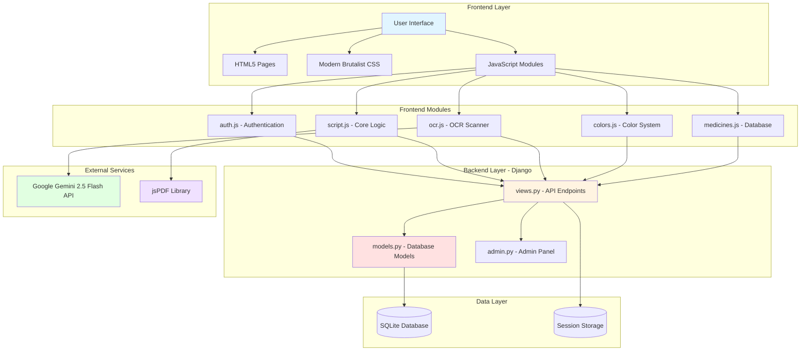

---

## 🔄 User Flow Diagram

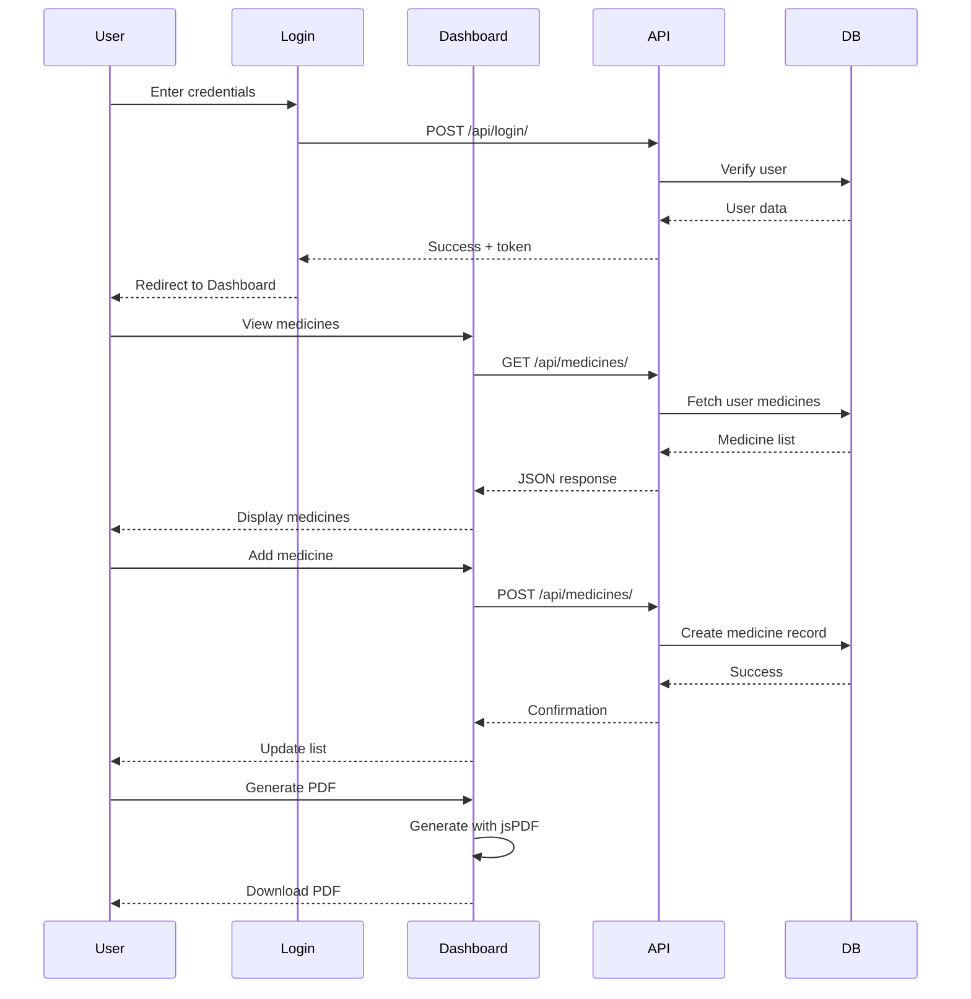

---

## 🎨 Color System Architecture

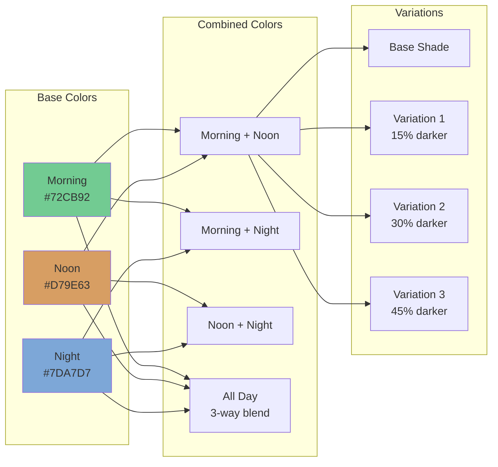

---

## 📊 Database Schema

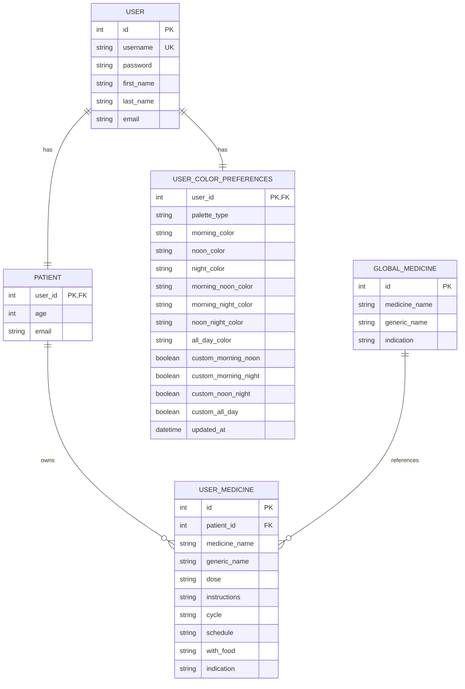

---

## 🔐 Security Architecture

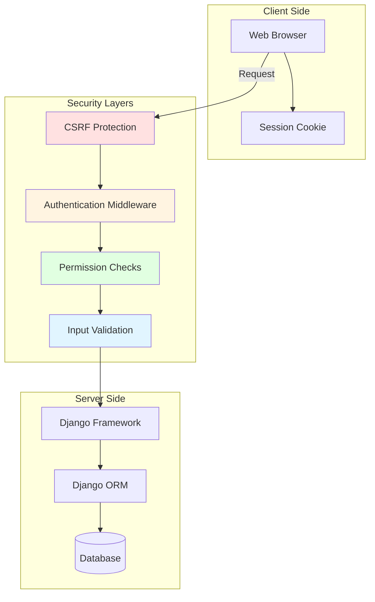

---

## 📱 Component Architecture

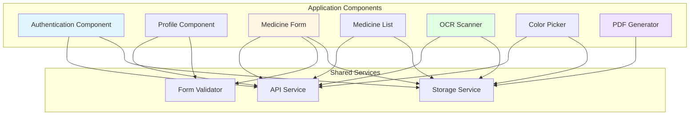

---

## 🚀 Deployment Architecture

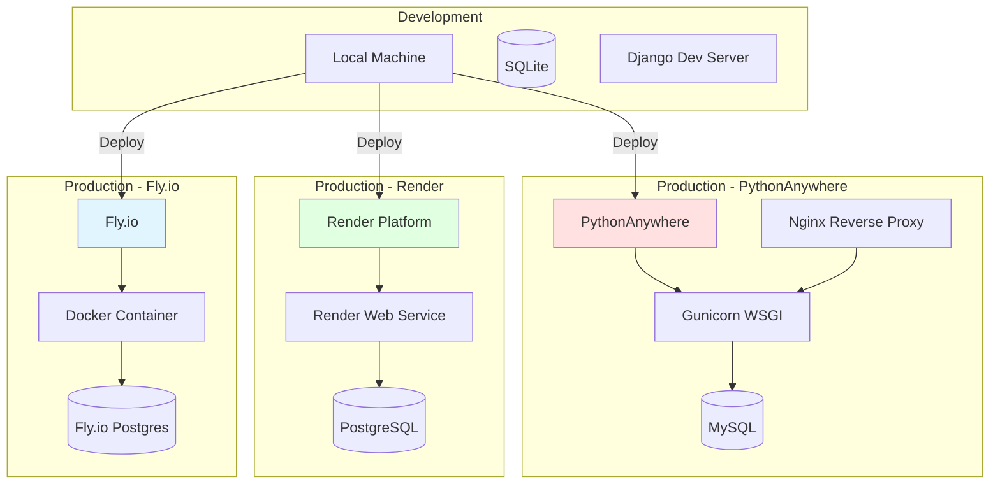

---

## 📡 API Request Flow

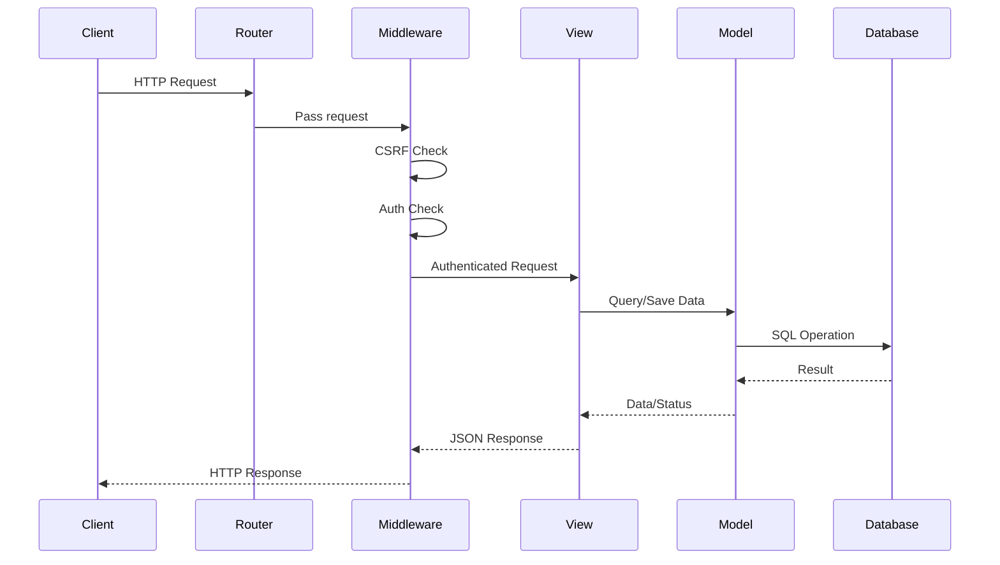

---

## 🎯 Feature Dependency Graph

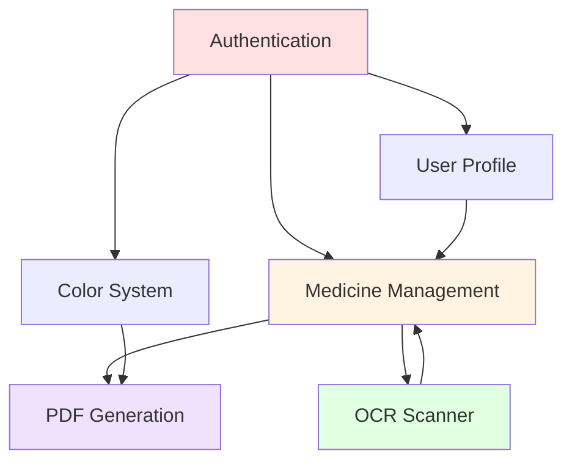

---

## 📦 Module Dependencies

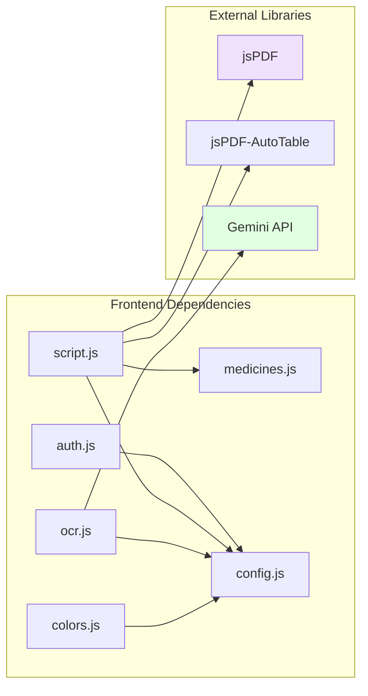

---

## 🔄 Data Flow: OCR to Medicine List

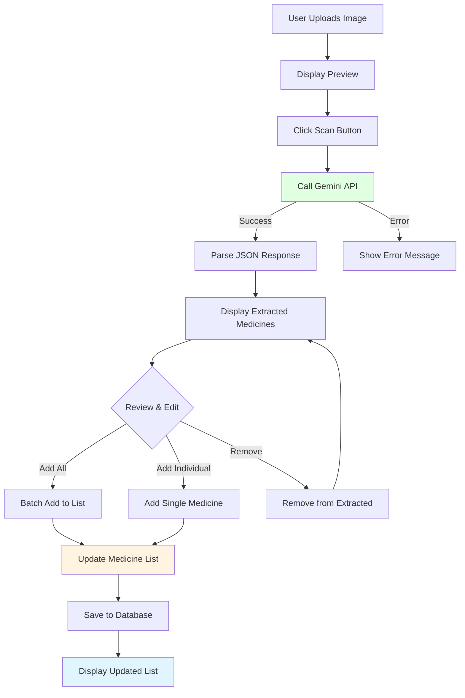

---

## 🎨 UI Component Hierarchy

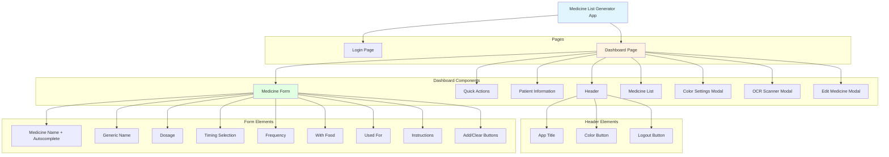

---

## 📊 Statistics & Metrics

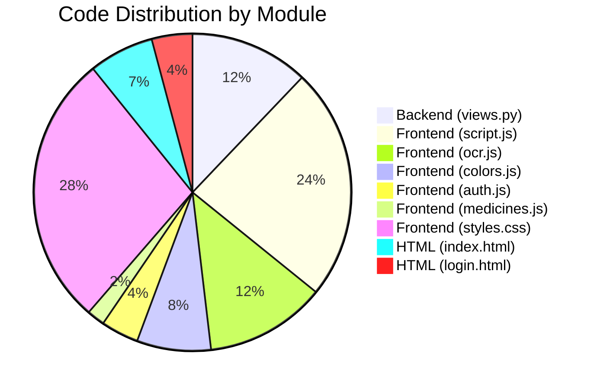

---

**Document Version**: 1.0.0
**Last Updated**: February 2026
