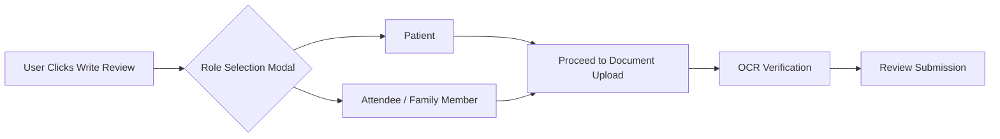
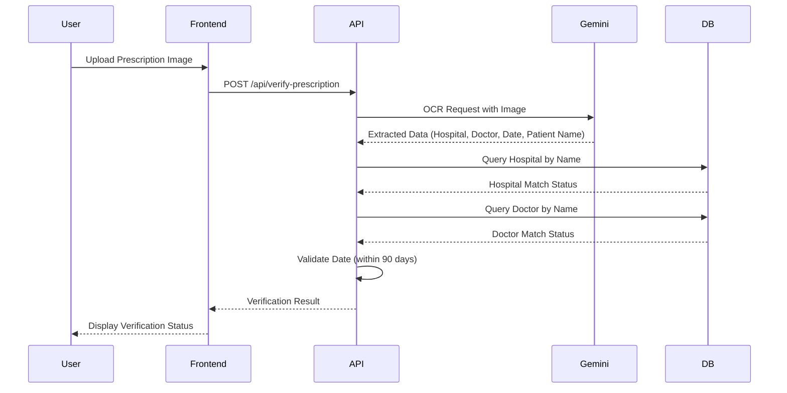
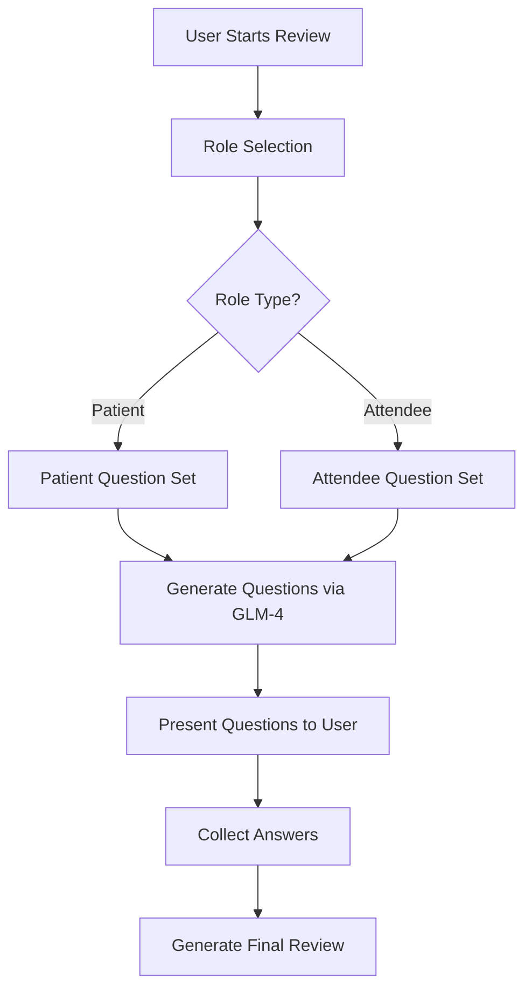

# MedVoice BD - Trust & Verification Architecture

## Executive Summary

This document outlines the architectural design for critical trust-building features in the MedVoice BD platform. The system is designed to prioritize user trust, prevent misinformation, and adapt to the healthcare reality where attendees (family members/friends) often manage patient logistics while patients focus on their health.

**Core Philosophy:** Medical trauma is not for "Liking" or "Retweeting." We are building a trust directory, not an echo chamber.

---

## 1. Verification & Role Management

### 1.1 The Attendee Reality

In the healthcare ecosystem of Bangladesh, the reality is that attendees (family members, friends, caregivers) handle the logistical aspects of medical visits while patients focus on their health. The system must capture both experiences accurately and verify physical possession of medical documents.

### 1.2 UX Role Selector

**Component:** Mandatory pre-review UI toggle

**Location:** Review creation workflow, before document upload

**UI Specification:**



**Frontend Implementation:**

- **Component:** `RoleSelector` component in the review creation flow
- **Required Field:** Role selection is mandatory before proceeding
- **Default State:** None selected (forces user choice)
- **Storage:** Role stored in session state and submitted with review data
- **Visual Design:** Two distinct, clearly labeled radio button cards with icons

**HTML Structure:**

```html
<div class="role-selector" data-required="true">
  <div class="role-option" data-role="patient">
    <div class="role-icon">
      <!-- Lucide: User icon -->
      <svg xmlns="http://www.w3.org/2000/svg" width="24" height="24" viewBox="0 0 24 24" fill="none" stroke="currentColor" stroke-width="2" stroke-linecap="round" stroke-linejoin="round">
        <path d="M20 21v-2a4 4 0 0 0-4-4H8a4 4 0 0 0-4 4v2"></path>
        <circle cx="12" cy="7" r="4"></circle>
      </svg>
    </div>
    <h3>I was the Patient</h3>
    <p>I personally received medical treatment</p>
  </div>
  <div class="role-option" data-role="attendee">
    <div class="role-icon">
      <!-- Lucide: Users icon -->
      <svg xmlns="http://www.w3.org/2000/svg" width="24" height="24" viewBox="0 0 24 24" fill="none" stroke="currentColor" stroke-width="2" stroke-linecap="round" stroke-linejoin="round">
        <path d="M17 21v-2a4 4 0 0 0-4-4H5a4 4 0 0 0-4 4v2"></path>
        <circle cx="9" cy="7" r="4"></circle>
        <path d="M23 21v-2a4 4 0 0 0-3-3.87"></path>
        <path d="M16 3.13a4 4 0 0 1 0 7.75"></path>
      </svg>
    </div>
    <h3>I was an Attendee / Family Member</h3>
    <p>I accompanied and managed logistics for the patient</p>
  </div>
</div>
```

**JavaScript Validation:**

```javascript
function validateRoleSelection() {
  const selectedRole = document.querySelector('.role-option.selected');
  if (!selectedRole) {
    showError('Please select your role to continue');
    return false;
  }
  return {
    role: selectedRole.dataset.role
  };
}
```

### 1.3 Verification Logic Fix

**Current Issue:** The Gemini Vision OCR service currently fails verification if the user's profile name differs from the patient name on the prescription.

**Required Fix:** The OCR service must strictly verify physical possession of the document by matching:

1. **Hospital Name** (exact or fuzzy match with hospital database)
2. **Doctor Name** (exact or fuzzy match with doctor database)
3. **Date** (within reasonable time window - e.g., last 90 days)

**Critical:** Verification MUST NOT fail if the user's profile name differs from the patient name on the prescription.

**Verification Flow:**



**Updated Gemini Service Prompt:**

```python
def _construct_verification_prompt(self):
    """
    Construct the OCR prompt for prescription verification.
    
    Returns:
        str: The verification prompt
    """
    prompt = f"""You are a medical prescription verification system. Extract the following information from this prescription image and return ONLY valid JSON:

{{
  "hospitalName": "string (exact hospital name from prescription)",
  "doctorName": "string (exact doctor name from prescription)",
  "visitDate": "string (date in YYYY-MM-DD format or null if not found)",
  "patientName": "string (patient name from prescription - DO NOT use for verification)",
  "confidence": "high | medium | low (confidence level of extraction)"
}}

IMPORTANT:
- Extract hospital name exactly as written
- Extract doctor name exactly as written  
- Extract date in YYYY-MM-DD format
- Extract patient name but this is NOT used for verification
- Return null for any field not clearly visible
- Only return valid JSON, no additional text
"""
    return prompt
```

**Verification Logic:**

```python
def verify_prescription(self, ocr_result, user_role):
    """
    Verify prescription based on OCR results.
    
    Args:
        ocr_result: Dictionary containing extracted OCR data
        user_role: 'patient' or 'attendee'
        
    Returns:
        dict: Verification result with status and details
    """
    verification_result = {
        'verified': False,
        'hospital_verified': False,
        'doctor_verified': False,
        'date_verified': False,
        'role': user_role,
        'badge_type': None
    }
    
    # Verify Hospital Name (fuzzy match allowed)
    if ocr_result.get('hospitalName'):
        hospital_match = Hospital.objects.filter(
            name__icontains=ocr_result['hospitalName']
        ).first()
        if hospital_match:
            verification_result['hospital_verified'] = True
    
    # Verify Doctor Name (fuzzy match allowed)
    if ocr_result.get('doctorName'):
        doctor_match = Doctor.objects.filter(
            name__icontains=ocr_result['doctorName']
        ).first()
        if doctor_match:
            verification_result['doctor_verified'] = True
    
    # Verify Date (within 90 days)
    if ocr_result.get('visitDate'):
        try:
            visit_date = datetime.strptime(ocr_result['visitDate'], '%Y-%m-%d').date()
            days_ago = (timezone.now().date() - visit_date).days
            if 0 <= days_ago <= 90:
                verification_result['date_verified'] = True
        except ValueError:
            pass
    
    # Overall verification requires hospital AND doctor match
    verification_result['verified'] = (
        verification_result['hospital_verified'] and
        verification_result['doctor_verified']
    )
    
    # Determine badge type
    if verification_result['verified']:
        if user_role == 'patient':
            verification_result['badge_type'] = 'verified_patient'
        else:
            verification_result['badge_type'] = 'verified_attendee'
    
    return verification_result
```

### 1.4 Two-Badge System

**Badge Logic:** Dynamic badge assignment based on OCR verification result and Role Selector.

**Badge Types:**

| Badge Type | Role | OCR Status | Display Text | Icon |
|------------|------|------------|--------------|------|
| Verified Patient | Patient | Hospital + Doctor Match | Verified Patient | Shield |
| Verified Attendee | Attendee | Hospital + Doctor Match | Verified Attendee | Shield |
| Unverified | Any | No Match | Unverified | Alert Circle |

**Badge Display Component:**

```html
<div class="review-badges">
  <div class="badge badge-verified-patient" data-badge-type="verified_patient">
    <svg xmlns="http://www.w3.org/2000/svg" width="16" height="16" viewBox="0 0 24 24" fill="none" stroke="currentColor" stroke-width="2" stroke-linecap="round" stroke-linejoin="round">
      <path d="M12 22s8-4 8-10V5l-8-3-8 3v7c0 6 8 10 8 10z"></path>
    </svg>
    <span>Verified Patient</span>
  </div>
  
  <div class="badge badge-verified-attendee" data-badge-type="verified_attendee">
    <svg xmlns="http://www.w3.org/2000/svg" width="16" height="16" viewBox="0 0 24 24" fill="none" stroke="currentColor" stroke-width="2" stroke-linecap="round" stroke-linejoin="round">
      <path d="M12 22s8-4 8-10V5l-8-3-8 3v7c0 6 8 10 8 10z"></path>
    </svg>
    <span>Verified Attendee</span>
  </div>
  
  <div class="badge badge-unverified" data-badge-type="unverified">
    <svg xmlns="http://www.w3.org/2000/svg" width="16" height="16" viewBox="0 0 24 24" fill="none" stroke="currentColor" stroke-width="2" stroke-linecap="round" stroke-linejoin="round">
      <circle cx="12" cy="12" r="10"></circle>
      <line x1="12" y1="8" x2="12" y2="12"></line>
      <line x1="12" y1="16" x2="12.01" y2="16"></line>
    </svg>
    <span>Unverified</span>
  </div>
</div>
```

**Badge Styling:**

```css
.badge {
  display: inline-flex;
  align-items: center;
  gap: 6px;
  padding: 4px 12px;
  border-radius: 20px;
  font-size: 12px;
  font-weight: 600;
  text-transform: uppercase;
  letter-spacing: 0.5px;
}

.badge-verified-patient {
  background: #e8f5e9;
  color: #2e7d32;
  border: 1px solid #c8e6c9;
}

.badge-verified-attendee {
  background: #e3f2fd;
  color: #1565c0;
  border: 1px solid #bbdefb;
}

.badge-unverified {
  background: #fff3e0;
  color: #ef6c00;
  border: 1px solid #ffe0b2;
}
```

---

## 2. Contextual AI Interviewer (GLM-4 Adaptation)

### 2.1 Dynamic Prompting Architecture

The GLM-4 AI Interviewer must dynamically shift its questioning strategy based on the selected role (Patient vs. Attendee). This ensures relevant questions are asked based on the user's actual experience.

**Prompt Flow:**



### 2.2 Patient-Focused Questioning

**Target Audience:** Users who personally received medical treatment

**Question Categories:**

1. **Physical Procedure Experience**
   - Was the procedure explained clearly before starting?
   - Did you experience any unexpected pain or discomfort?
   - How would you rate the technical skill of the doctor?

2. **Doctor's Bedside Manner**
   - Did the doctor listen to your concerns?
   - Were you treated with respect and dignity?
   - Did the doctor take time to answer your questions?

3. **Medication Explanation**
   - Were your medications explained clearly?
   - Were potential side effects discussed?
   - Do you understand how and when to take your medications?

**GLM-4 Patient Prompt:**

```python
def _construct_patient_interview_prompt(self, doctor_name, hospital_name):
    """
    Construct the AI interviewer prompt for patient role.
    
    Args:
        doctor_name: Name of the doctor being reviewed
        hospital_name: Name of the hospital
        
    Returns:
        str: The patient-focused interview prompt
    """
    prompt = f"""You are a compassionate medical review interviewer. Generate 5-7 relevant questions for a patient who visited Dr. {doctor_name} at {hospital_name}.

Focus on:
1. Physical procedure experience and technical skill
2. Doctor's bedside manner and communication
3. Medication explanation and understanding

Return ONLY valid JSON in this format:
{{
  "questions": [
    {{
      "id": "q1",
      "question": "string (clear, empathetic question)",
      "category": "procedure" | "bedside_manner" | "medication",
      "type": "rating" | "text" | "yes_no"
    }}
  ]
}}

Guidelines:
- Questions should be empathetic and non-judgmental
- Use simple, clear language
- Mix rating (1-5 stars), text, and yes/no questions
- Avoid leading questions
- Focus on the patient's personal experience
"""
    return prompt
```

### 2.3 Attendee-Focused Questioning

**Target Audience:** Users who accompanied and managed logistics for the patient

**Question Categories:**

1. **Waiting Area Conditions**
   - How was the cleanliness of the waiting area?
   - Was seating adequate for the number of patients?
   - Was the waiting area climate-controlled (AC/fans)?

2. **Nurse Responsiveness**
   - How quickly did nurses respond to calls?
   - Were nurses helpful and informative?
   - Did nurses communicate clearly about procedures?

3. **Billing Transparency**
   - Were all costs explained upfront?
   - Were there any hidden or unexpected charges?
   - Was the billing process clear and organized?

4. **Hospital Management**
   - How was the overall organization of the facility?
   - Were appointment times respected?
   - How would you rate the administrative staff?

**GLM-4 Attendee Prompt:**

```python
def _construct_attendee_interview_prompt(self, doctor_name, hospital_name):
    """
    Construct the AI interviewer prompt for attendee role.
    
    Args:
        doctor_name: Name of the doctor being reviewed
        hospital_name: Name of the hospital
        
    Returns:
        str: The attendee-focused interview prompt
    """
    prompt = f"""You are a medical review interviewer focused on healthcare logistics. Generate 5-7 relevant questions for an attendee/family member who accompanied a patient to Dr. {doctor_name} at {hospital_name}.

Focus on:
1. Waiting area conditions and facilities
2. Nurse responsiveness and care
3. Billing transparency and costs
4. Hospital management and organization

Return ONLY valid JSON in this format:
{{
  "questions": [
    {{
      "id": "q1",
      "question": "string (clear, practical question)",
      "category": "waiting_area" | "nurse_care" | "billing" | "management",
      "type": "rating" | "text" | "yes_no"
    }}
  ]
}}

Guidelines:
- Questions should focus on logistics and management
- Use simple, clear language
- Mix rating (1-5 stars), text, and yes/no questions
- Avoid leading questions
- Focus on the attendee's observational experience
- Consider the unique perspective of someone managing logistics
"""
    return prompt
```

### 2.4 Dynamic Question Selection Logic

```python
def generate_interview_questions(self, role, doctor_name, hospital_name):
    """
    Generate interview questions based on user role.
    
    Args:
        role: 'patient' or 'attendee'
        doctor_name: Name of the doctor being reviewed
        hospital_name: Name of the hospital
        
    Returns:
        dict: Generated questions
    """
    if role == 'patient':
        prompt = self._construct_patient_interview_prompt(doctor_name, hospital_name)
    elif role == 'attendee':
        prompt = self._construct_attendee_interview_prompt(doctor_name, hospital_name)
    else:
        raise ValueError(f"Invalid role: {role}")
    
    response = self._call_glm_api(prompt)
    return self._parse_questions_response(response)
```

---

## 3. Trust & Engagement Ecosystem

### 3.1 Philosophy

Medical experiences involve trauma, vulnerability, and sensitive health information. Traditional social engagement patterns (Likes, Retweets, Shares) are inappropriate for this context. We are building a **trust directory**, not an echo chamber.

**Core Principles:**

1. **Utility over Virality:** Content should be judged by helpfulness, not popularity
2. **Accuracy over Amplification:** Misinformation should be corrected, not amplified
3. **Privacy over Publicity:** Medical experiences are shared privately, not publicly

### 3.2 Helpful / Not Helpful Voting System

**Concept:** Replace traditional "Likes/Retweets" with an Upvote (Helpful) / Downvote (Not Helpful) system similar to Reddit/Amazon.

**Voting Interface:**

```html
<div class="vote-controls" data-review-id="123">
  <button class="vote-btn btn-upvote" data-vote-type="helpful">
    <svg xmlns="http://www.w3.org/2000/svg" width="18" height="18" viewBox="0 0 24 24" fill="none" stroke="currentColor" stroke-width="2" stroke-linecap="round" stroke-linejoin="round">
      <path d="M18 15l-6-6-6 6"></path>
    </svg>
    <span class="vote-count">24</span>
    <span class="vote-label">Helpful</span>
  </button>
  
  <button class="vote-btn btn-downvote" data-vote-type="not_helpful">
    <svg xmlns="http://www.w3.org/2000/svg" width="18" height="18" viewBox="0 0 24 24" fill="none" stroke="currentColor" stroke-width="2" stroke-linecap="round" stroke-linejoin="round">
      <path d="M6 9l6 6 6-6"></path>
    </svg>
    <span class="vote-count">3</span>
    <span class="vote-label">Not Helpful</span>
  </button>
</div>
```

**Sorting Algorithm:**

Reviews on a doctor's profile should be sorted using a Wilson Score Interval (similar to Reddit/Amazon) to balance helpful votes with confidence:

```python
def calculate_review_score(helpful_count, not_helpful_count):
    """
    Calculate review score using Wilson Score Interval.
    
    This provides a statistically sound ranking that balances
    helpful votes with confidence based on total votes.
    
    Args:
        helpful_count: Number of helpful votes
        not_helpful_count: Number of not helpful votes
        
    Returns:
        float: Wilson score between 0 and 1
    """
    import math
    
    n = helpful_count + not_helpful_count
    
    if n == 0:
        return 0.0
    
    p_hat = helpful_count / n
    z = 1.96  # 95% confidence interval
    
    numerator = p_hat + (z * z) / (2 * n) - z * math.sqrt(
        (p_hat * (1 - p_hat) + (z * z) / (4 * n)) / n
    )
    denominator = 1 + (z * z) / n
    
    score = numerator / denominator
    return max(0.0, min(1.0, score))
```

**Display Logic:**

```python
def get_sorted_reviews(doctor_id):
    """
    Get reviews sorted by Wilson score.
    
    Args:
        doctor_id: ID of the doctor
        
    Returns:
        QuerySet: Sorted reviews
    """
    reviews = Review.objects.filter(doctor_id=doctor_id)
    
    # Annotate with Wilson score
    for review in reviews:
        review.score = calculate_review_score(
            review.helpful_count,
            review.not_helpful_count
        )
    
    # Sort by score descending, then by date
    return sorted(reviews, key=lambda r: (-r.score, -r.created_at.timestamp()))
```

### 3.3 Community Notes System

**Concept:** A system where highly trusted users (those with multiple Verified badges) can append factual corrections to reviews. This corrects misinformation at the source without amplifying the post.

**Trust Level Calculation:**

```python
def calculate_user_trust_level(user):
    """
    Calculate user trust level based on verified reviews.
    
    Trust Levels:
    - Level 0: No verified reviews
    - Level 1: 1-2 verified reviews
    - Level 2: 3-5 verified reviews
    - Level 3: 6+ verified reviews (can add Community Notes)
    
    Args:
        user: User object
        
    Returns:
        int: Trust level (0-3)
    """
    verified_review_count = Review.objects.filter(
        user=user,
        verification_status='verified'
    ).count()
    
    if verified_review_count == 0:
        return 0
    elif verified_review_count <= 2:
        return 1
    elif verified_review_count <= 5:
        return 2
    else:
        return 3
```

**Community Note Component:**

```html
<div class="community-notes" data-review-id="123">
  <div class="notes-header">
    <svg xmlns="http://www.w3.org/2000/svg" width="16" height="16" viewBox="0 0 24 24" fill="none" stroke="currentColor" stroke-width="2" stroke-linecap="round" stroke-linejoin="round">
      <path d="M2 3h6a4 4 0 0 1 4 4v14a3 3 0 0 0-3-3H2z"></path>
      <path d="M22 3h-6a4 4 0 0 0-4 4v14a3 3 0 0 1 3-3h7z"></path>
    </svg>
    <h4>Community Notes</h4>
  </div>
  
  <div class="notes-list">
    <div class="community-note" data-note-id="1">
      <div class="note-author">
        
        <span class="note-author-name">Ahmed Rahman</span>
        <span class="note-badges">
          <span class="badge badge-verified-patient">Verified Patient</span>
          <span class="badge badge-verified-attendee">Verified Attendee</span>
        </span>
      </div>
      <div class="note-content">
        <p>The consultation fee mentioned (50,000 Tk) appears to be incorrect. The official rate card shows 1,500 Tk for general consultation.</p>
        <a href="/hospitals/xyz-hospital/rate-card" target="_blank" class="note-source">
          View Official Rate Card
          <svg xmlns="http://www.w3.org/2000/svg" width="14" height="14" viewBox="0 0 24 24" fill="none" stroke="currentColor" stroke-width="2" stroke-linecap="round" stroke-linejoin="round">
            <path d="M18 13v6a2 2 0 0 1-2 2H5a2 2 0 0 1-2-2V8a2 2 0 0 1 2-2h6"></path>
            <polyline points="15 3 21 3 21 9"></polyline>
            <line x1="10" y1="14" x2="21" y2="3"></line>
          </svg>
        </a>
      </div>
      <div class="note-meta">
        <span class="note-date">March 10, 2026</span>
        <span class="note-votes">
          <span class="note-helpful">12 found this helpful</span>
        </span>
      </div>
    </div>
  </div>
  
  <div class="add-note-form" data-user-trust-level="3">
    <textarea placeholder="Add a factual correction with source link..." class="note-input"></textarea>
    <input type="url" placeholder="Source URL (required)" class="note-source-input">
    <button type="submit" class="btn-submit-note">Submit Note</button>
  </div>
</div>
```

**Community Note Rules:**

1. **Trust Requirement:** Only users with Trust Level 3 (6+ verified reviews) can add Community Notes
2. **Source Required:** All notes must include a verifiable source URL
3. **Factual Only:** Notes must be factual corrections, not opinions
4. **No Amplification:** Community Notes do not increase the visibility of the original review
5. **Moderation:** Notes are subject to moderation and can be removed

### 3.4 WhatsApp Open Graph Sharing

**Concept:** A "Share to WhatsApp/Messenger" button that dynamically generates a clean Open Graph (OG) image for private recommendations shared off-platform.

**Share Button Component:**

```html
<button class="btn-share-whatsapp" data-review-id="123">
  <svg xmlns="http://www.w3.org/2000/svg" width="20" height="20" viewBox="0 0 24 24" fill="none" stroke="currentColor" stroke-width="2" stroke-linecap="round" stroke-linejoin="round">
    <path d="M22 16.92v3a2 2 0 0 1-2.18 2 19.79 19.79 0 0 1-8.63-3.07 19.5 19.5 0 0 1-6-6 19.79 19.79 0 0 1-3.07-8.67A2 2 0 0 1 4.11 2h3a2 2 0 0 1 2 1.72 12.84 12.84 0 0 0 .7 2.81 2 2 0 0 1-.45 2.11L8.09 9.91a16 16 0 0 0 6 6l1.27-1.27a2 2 0 0 1 2.11-.45 12.84 12.84 0 0 0 2.81.7A2 2 0 0 1 22 16.92z"></path>
  </svg>
  <span>Share to WhatsApp</span>
</button>
```

**OG Image Generation (Celery Background Task):**

**Critical Performance Note:** Drawing images with Pillow is CPU-intensive. The OG image generation must be wrapped as a Celery `@shared_task` to prevent blocking the user's request. When a review is published, Celery generates the image in the background.

**Celery Task Implementation:**

```python
# File: medicineList/backend/tasks.py
from celery import shared_task
from PIL import Image, ImageDraw, ImageFont
from django.conf import settings
import os

@shared_task(bind=True, max_retries=3)
def generate_og_image_task(self, review_id):
    """
    Generate Open Graph image for review sharing.
    
    This is a Celery background task to prevent blocking the user's request.
    Image generation with Pillow is CPU-intensive and should run asynchronously.
    
    Creates a sleek card with:
    - Doctor's Name
    - Star Rating
    - Review Snippet
    
    Args:
        review_id: ID of the review
        
    Returns:
        str: URL to generated OG image
        
    Raises:
        Exception: Retries up to 3 times on failure
    """
    try:
        from medicines.models import Review
        
        review = Review.objects.get(id=review_id)
        doctor = review.doctor
        
        # Update review status to generating
        review.og_image_status = 'generating'
        review.save()
        
        # Create image using PIL
        # Image dimensions (1200x630 for optimal OG)
        width, height = 1200, 630
        img = Image.new('RGB', (width, height), color='#ffffff')
        draw = ImageDraw.Draw(img)
        
        # Background gradient (subtle)
        for y in range(height):
            r = int(255 - (y / height) * 20)
            g = int(255 - (y / height) * 20)
            b = int(255 - (y / height) * 30)
            draw.line([(0, y), (width, y)], fill=(r, g, b))
        
        # Doctor name
        font_large = ImageFont.truetype('arial.ttf', 48)
        draw.text((60, 100), f"Dr. {doctor.name}", fill='#1a1a1a', font=font_large)
        
        # Hospital name
        font_medium = ImageFont.truetype('arial.ttf', 32)
        draw.text((60, 170), doctor.hospital.name, fill='#666666', font=font_medium)
        
        # Star rating
        rating = review.rating
        stars = "★" * rating + "☆" * (5 - rating)
        draw.text((60, 240), stars, fill='#ffc107', font=font_large)
        
        # Review snippet (truncated)
        font_small = ImageFont.truetype('arial.ttf', 24)
        snippet = review.content[:200] + "..." if len(review.content) > 200 else review.content
        draw.text((60, 320), f'"{snippet}"', fill='#333333', font=font_small)
        
        # MedVoice branding
        draw.text((60, 550), "medvoice.bd", fill='#0066cc', font=font_medium)
        
        # Ensure directory exists
        og_dir = os.path.join(settings.MEDIA_ROOT, 'og_images')
        os.makedirs(og_dir, exist_ok=True)
        
        # Save image
        image_filename = f'review_{review_id}.png'
        image_path = os.path.join(og_dir, image_filename)
        img.save(image_path, 'PNG')
        
        # Update review status to completed
        review.og_image_path = f'/media/og_images/{image_filename}'
        review.og_image_status = 'completed'
        review.og_image_generated_at = timezone.now()
        review.save()
        
        return review.og_image_path
        
    except Exception as exc:
        # Update review status to failed
        try:
            review = Review.objects.get(id=review_id)
            review.og_image_status = 'failed'
            review.og_image_error = str(exc)
            review.save()
        except:
            pass
        
        # Retry the task
        raise self.retry(exc=exc, countdown=60)
```

**Triggering the Task:**

```python
# File: medicineList/backend/medicines/views.py
from django.utils import timezone
from .tasks import generate_og_image_task

def publish_review(request, review_id):
    """
    Publish a review and trigger OG image generation.
    
    The image generation happens asynchronously in the background,
    so the user doesn't wait for the CPU-intensive operation.
    """
    review = get_object_or_404(Review, id=review_id, user=request.user)
    
    # Mark review as published
    review.is_published = True
    review.published_at = timezone.now()
    review.save()
    
    # Trigger OG image generation asynchronously
    # This returns immediately without blocking
    task = generate_og_image_task.delay(review.id)
    
    # Store task ID for status checking
    review.og_image_task_id = task.id
    review.save()
    
    return JsonResponse({
        'success': True,
        'review_id': review.id,
        'og_image_status': 'generating',
        'share_url': f'https://medvoice.bd/reviews/{review.id}'
    })
```

**Share URL Generation:**

```python
def generate_share_url(review_id):
    """
    Generate share URL with OG metadata.
    
    Since OG image generation is asynchronous, this returns the review URL.
    The OG image will be available once the Celery task completes.
    
    Args:
        review_id: ID of the review
        
    Returns:
        str: Share URL
    """
    return f'https://medvoice.bd/reviews/{review_id}'
```

**OG Image Status Checking:**

```python
def get_og_image_status(review_id):
    """
    Check the status of OG image generation.
    
    Args:
        review_id: ID of the review
        
    Returns:
        dict: Status information
    """
    review = Review.objects.get(id=review_id)
    
    return {
        'status': review.og_image_status,
        'image_url': review.og_image_path if review.og_image_status == 'completed' else None,
        'error': review.og_image_error if review.og_image_status == 'failed' else None,
        'generated_at': review.og_image_generated_at.isoformat() if review.og_image_generated_at else None
    }
```

**Frontend Polling for Image Status:**

```javascript
// Poll for OG image generation status
function pollOGImageStatus(reviewId, callback, maxAttempts = 30) {
  let attempts = 0;
  
  const poll = async () => {
    attempts++;
    
    try {
      const response = await fetch(`/api/reviews/${reviewId}/og-status/`);
      const data = await response.json();
      
      if (data.status === 'completed') {
        callback({ success: true, imageUrl: data.image_url });
      } else if (data.status === 'failed') {
        callback({ success: false, error: data.error });
      } else if (attempts < maxAttempts) {
        // Continue polling
        setTimeout(poll, 2000); // Poll every 2 seconds
      } else {
        callback({ success: false, error: 'Timeout waiting for image generation' });
      }
    } catch (error) {
      if (attempts < maxAttempts) {
        setTimeout(poll, 2000);
      } else {
        callback({ success: false, error: 'Network error while checking status' });
      }
    }
  };
  
  poll();
}

// Usage example
function shareToWhatsApp(reviewId) {
  const shareUrl = generateShareUrl(reviewId);
  const text = `Check out this doctor review on MedVoice BD`;
  
  // Show loading state
  showShareLoading();
  
  // Poll for OG image status
  pollOGImageStatus(reviewId, (result) => {
    hideShareLoading();
    
    if (result.success) {
      // Image is ready, share with full URL
      const whatsappUrl = `https://wa.me/?text=${encodeURIComponent(text)} ${encodeURIComponent(shareUrl)}`;
      window.open(whatsappUrl, '_blank');
    } else {
      // Image generation failed, still allow sharing
      const whatsappUrl = `https://wa.me/?text=${encodeURIComponent(text)} ${encodeURIComponent(shareUrl)}`;
      window.open(whatsappUrl, '_blank');
      showWarning('Share image could not be generated, but link is ready');
    }
  });
}
```

**Celery Configuration:**

```python
# File: medicineList/backend/medlist_backend/celery.py
from celery import Celery
from celery.schedules import crontab
import os

# Set the default Django settings module for the 'celery' program.
os.environ.setdefault('DJANGO_SETTINGS_MODULE', 'medlist_backend.settings')

app = Celery('medlist_backend')

# Using a string here means the worker doesn't have to serialize
# the configuration object to child processes.
app.config_from_object('django.conf:settings', namespace='CELERY')

# Load task modules from all registered Django apps.
app.autodiscover_tasks()

# Configure task routing for OG image generation
app.conf.task_routes = {
    'medicines.tasks.generate_og_image_task': {
        'queue': 'image-generation',
        'routing_key': 'image.generate',
    },
}

# Configure task time limits
app.conf.task_time_limit = 300  # 5 minutes max per task
app.conf.task_soft_time_limit = 240  # 4 minutes soft limit

# Configure task retries
app.conf.task_acks_late = True
app.conf.task_reject_on_worker_lost = True
```

**WhatsApp Share Implementation:**

```javascript
function shareToWhatsApp(reviewId) {
  const shareUrl = generateShareUrl(reviewId);
  const text = `Check out this doctor review on MedVoice BD`;
  
  const whatsappUrl = `https://wa.me/?text=${encodeURIComponent(text)} ${encodeURIComponent(shareUrl)}`;
  
  window.open(whatsappUrl, '_blank');
}
```

---

## 4. Technical Implementation Notes

### 4.1 Django Model Updates

**Review Model Additions:**

```python
class Review(BaseModel):
    """Medical review with trust features"""
    
    # Existing fields
    user = models.ForeignKey(settings.AUTH_USER_MODEL, on_delete=models.CASCADE)
    doctor = models.ForeignKey('Doctor', on_delete=models.CASCADE)
    content = models.TextField()
    rating = models.IntegerField(choices=[(i, i) for i in range(1, 6)])
    
    # NEW: Role field
    ROLE_CHOICES = [
        ('patient', 'Patient'),
        ('attendee', 'Attendee / Family Member'),
    ]
    role = models.CharField(max_length=20, choices=ROLE_CHOICES)
    
    # NEW: Verification status
    VERIFICATION_STATUS_CHOICES = [
        ('unverified', 'Unverified'),
        ('verified_patient', 'Verified Patient'),
        ('verified_attendee', 'Verified Attendee'),
    ]
    verification_status = models.CharField(
        max_length=30,
        choices=VERIFICATION_STATUS_CHOICES,
        default='unverified'
    )
    
    # NEW: Verification details
    hospital_verified = models.BooleanField(default=False)
    doctor_verified = models.BooleanField(default=False)
    date_verified = models.BooleanField(default=False)
    verification_date = models.DateTimeField(null=True, blank=True)
    
    # NEW: Voting system
    helpful_count = models.IntegerField(default=0)
    not_helpful_count = models.IntegerField(default=0)
    
    # NEW: OG Image Generation (Celery background task)
    OG_IMAGE_STATUS_CHOICES = [
        ('pending', 'Pending'),
        ('generating', 'Generating'),
        ('completed', 'Completed'),
        ('failed', 'Failed'),
    ]
    og_image_status = models.CharField(
        max_length=20,
        choices=OG_IMAGE_STATUS_CHOICES,
        default='pending'
    )
    og_image_path = models.CharField(max_length=500, blank=True, null=True)
    og_image_task_id = models.CharField(max_length=255, blank=True, null=True)
    og_image_generated_at = models.DateTimeField(null=True, blank=True)
    og_image_error = models.TextField(blank=True, null=True)
    
    # NEW: Wilson score for sorting (calculated field)
    @property
    def wilson_score(self):
        return calculate_review_score(self.helpful_count, self.not_helpful_count)
    
    class Meta:
        db_table = 'reviews'
        verbose_name = "Review"
        verbose_name_plural = "Reviews"
        ordering = ['-created_at']
```

**CommunityNote Model:**

```python
class CommunityNote(BaseModel):
    """Factual corrections added by trusted users"""
    
    review = models.ForeignKey('Review', on_delete=models.CASCADE, related_name='community_notes')
    author = models.ForeignKey(settings.AUTH_USER_MODEL, on_delete=models.CASCADE)
    content = models.TextField()
    source_url = models.URLField()
    
    # Voting for notes
    helpful_count = models.IntegerField(default=0)
    
    # Moderation
    is_approved = models.BooleanField(default=True)
    is_removed = models.BooleanField(default=False)
    removal_reason = models.TextField(blank=True, null=True)
    
    class Meta:
        db_table = 'community_notes'
        verbose_name = "Community Note"
        verbose_name_plural = "Community Notes"
        ordering = ['-created_at']
```

**ReviewVote Model:**

```python
class ReviewVote(BaseModel):
    """Track user votes on reviews"""
    
    VOTE_CHOICES = [
        ('helpful', 'Helpful'),
        ('not_helpful', 'Not Helpful'),
    ]
    
    review = models.ForeignKey('Review', on_delete=models.CASCADE, related_name='votes')
    user = models.ForeignKey(settings.AUTH_USER_MODEL, on_delete=models.CASCADE)
    vote_type = models.CharField(max_length=20, choices=VOTE_CHOICES)
    
    class Meta:
        db_table = 'review_votes'
        verbose_name = "Review Vote"
        verbose_name_plural = "Review Votes"
        unique_together = ['review', 'user']  # One vote per user per review
```

**Doctor Model Additions:**

```python
class Doctor(BaseModel):
    """Doctor profile"""
    
    # Existing fields
    name = models.CharField(max_length=255)
    hospital = models.ForeignKey('Hospital', on_delete=models.CASCADE)
    specialty = models.CharField(max_length=255)
    
    # NEW: Aggregate rating based on verified reviews only
    @property
    def verified_rating(self):
        verified_reviews = self.reviews.filter(
            verification_status__in=['verified_patient', 'verified_attendee']
        )
        if not verified_reviews.exists():
            return None
        return verified_reviews.aggregate(
            avg_rating=Avg('rating')
        )['avg_rating']
    
    # NEW: Count of verified reviews
    @property
    def verified_review_count(self):
        return self.reviews.filter(
            verification_status__in=['verified_patient', 'verified_attendee']
        ).count()
```

### 4.2 Gemini Service Updates

**Updated OCR Prompt for Verification:**

```python
def _construct_verification_ocr_prompt(self):
    """
    Construct OCR prompt for prescription verification.
    
    Returns:
        str: The verification OCR prompt
    """
    prompt = f"""You are a medical prescription verification system. Extract the following information from this prescription image and return ONLY valid JSON:

{{
  "hospitalName": "string (exact hospital name from prescription)",
  "doctorName": "string (exact doctor name from prescription)",
  "visitDate": "string (date in YYYY-MM-DD format or null if not found)",
  "patientName": "string (patient name from prescription - DO NOT use for verification)",
  "confidence": "high | medium | low (confidence level of extraction)"
}}

CRITICAL INSTRUCTIONS:
- Extract hospital name exactly as written (fuzzy matching will be applied)
- Extract doctor name exactly as written (fuzzy matching will be applied)
- Extract date in YYYY-MM-DD format (must be within 90 days)
- Extract patient name but this is NOT used for verification
- Verification is based on hospital + doctor match only
- Return null for any field not clearly visible
- Only return valid JSON, no additional text
"""
    return prompt
```

### 4.3 GLM Service Updates

**Dynamic Interview Prompt Generation:**

```python
def generate_interview_prompt(self, role, doctor_name, hospital_name):
    """
    Generate interview prompt based on user role.
    
    Args:
        role: 'patient' or 'attendee'
        doctor_name: Name of the doctor
        hospital_name: Name of the hospital
        
    Returns:
        str: The generated prompt
    """
    if role == 'patient':
        return self._construct_patient_interview_prompt(doctor_name, hospital_name)
    elif role == 'attendee':
        return self._construct_attendee_interview_prompt(doctor_name, hospital_name)
    else:
        raise ValueError(f"Invalid role: {role}")

def _construct_patient_interview_prompt(self, doctor_name, hospital_name):
    """
    Construct patient-focused interview prompt.
    
    Returns:
        str: The patient interview prompt
    """
    return f"""You are a compassionate medical review interviewer. Generate 5-7 relevant questions for a patient who visited Dr. {doctor_name} at {hospital_name}.

Focus on:
1. Physical procedure experience and technical skill
2. Doctor's bedside manner and communication
3. Medication explanation and understanding

Return ONLY valid JSON in this format:
{{
  "questions": [
    {{
      "id": "q1",
      "question": "string (clear, empathetic question)",
      "category": "procedure" | "bedside_manner" | "medication",
      "type": "rating" | "text" | "yes_no"
    }}
  ]
}}

Guidelines:
- Questions should be empathetic and non-judgmental
- Use simple, clear language
- Mix rating (1-5 stars), text, and yes/no questions
- Avoid leading questions
- Focus on the patient's personal experience
"""

def _construct_attendee_interview_prompt(self, doctor_name, hospital_name):
    """
    Construct attendee-focused interview prompt.
    
    Returns:
        str: The attendee interview prompt
    """
    return f"""You are a medical review interviewer focused on healthcare logistics. Generate 5-7 relevant questions for an attendee/family member who accompanied a patient to Dr. {doctor_name} at {hospital_name}.

Focus on:
1. Waiting area conditions and facilities
2. Nurse responsiveness and care
3. Billing transparency and costs
4. Hospital management and organization

Return ONLY valid JSON in this format:
{{
  "questions": [
    {{
      "id": "q1",
      "question": "string (clear, practical question)",
      "category": "waiting_area" | "nurse_care" | "billing" | "management",
      "type": "rating" | "text" | "yes_no"
    }}
  ]
}}

Guidelines:
- Questions should focus on logistics and management
- Use simple, clear language
- Mix rating (1-5 stars), text, and yes/no questions
- Avoid leading questions
- Focus on the attendee's observational experience
- Consider the unique perspective of someone managing logistics
"""
```

### 4.4 API Endpoints

**New Endpoints Required:**

```
POST /api/reviews/verify-prescription/
    - Upload and verify prescription image
    - Returns verification status and badge type

POST /api/reviews/generate-interview-questions/
    - Generate AI interview questions based on role
    - Returns dynamic question set

POST /api/reviews/vote/
    - Submit helpful/not helpful vote
    - Updates vote counts

GET /api/reviews/{review_id}/community-notes/
    - Get community notes for a review

POST /api/reviews/{review_id}/community-notes/
    - Add a community note (requires Trust Level 3)

GET /api/reviews/{review_id}/share/
    - Generate share URL with OG image

GET /api/reviews/{review_id}/og-status/
    - Check OG image generation status
    - Returns status, image URL, and error if any
```

### 4.5 Frontend Components

**Required New Components:**

1. `RoleSelector` - Mandatory role selection before review creation
2. `VerificationBadge` - Display verification status badge
3. `VoteControls` - Helpful/Not Helpful voting interface
4. `CommunityNotes` - Display and add community notes
5. `ShareButton` - WhatsApp/Messenger sharing with OG image
6. `InterviewQuestions` - Dynamic AI interviewer interface

### 4.6 Database Migrations

**Required Migrations:**

```python
# Migration: Add trust fields to Review model
operations = [
    migrations.AddField(
        model_name='review',
        name='role',
        field=models.CharField(
            max_length=20,
            choices=[('patient', 'Patient'), ('attendee', 'Attendee / Family Member')],
        ),
    ),
    migrations.AddField(
        model_name='review',
        name='verification_status',
        field=models.CharField(
            max_length=30,
            choices=[
                ('unverified', 'Unverified'),
                ('verified_patient', 'Verified Patient'),
                ('verified_attendee', 'Verified Attendee'),
            ],
            default='unverified',
        ),
    ),
    migrations.AddField(
        model_name='review',
        name='hospital_verified',
        field=models.BooleanField(default=False),
    ),
    migrations.AddField(
        model_name='review',
        name='doctor_verified',
        field=models.BooleanField(default=False),
    ),
    migrations.AddField(
        model_name='review',
        name='date_verified',
        field=models.BooleanField(default=False),
    ),
    migrations.AddField(
        model_name='review',
        name='verification_date',
        field=models.DateTimeField(null=True, blank=True),
    ),
    migrations.AddField(
        model_name='review',
        name='helpful_count',
        field=models.IntegerField(default=0),
    ),
    migrations.AddField(
        model_name='review',
        name='not_helpful_count',
        field=models.IntegerField(default=0),
    ),
    migrations.AddField(
        model_name='review',
        name='og_image_status',
        field=models.CharField(
            max_length=20,
            choices=[
                ('pending', 'Pending'),
                ('generating', 'Generating'),
                ('completed', 'Completed'),
                ('failed', 'Failed'),
            ],
            default='pending',
        ),
    ),
    migrations.AddField(
        model_name='review',
        name='og_image_path',
        field=models.CharField(max_length=500, blank=True, null=True),
    ),
    migrations.AddField(
        model_name='review',
        name='og_image_task_id',
        field=models.CharField(max_length=255, blank=True, null=True),
    ),
    migrations.AddField(
        model_name='review',
        name='og_image_generated_at',
        field=models.DateTimeField(null=True, blank=True),
    ),
    migrations.AddField(
        model_name='review',
        name='og_image_error',
        field=models.TextField(blank=True, null=True),
    ),
]

# Migration: Create CommunityNote model
operations = [
    migrations.CreateModel(
        name='CommunityNote',
        fields=[
            ('id', models.BigAutoField(primary_key=True)),
            ('created_at', models.DateTimeField(auto_now_add=True)),
            ('updated_at', models.DateTimeField(auto_now=True)),
            ('content', models.TextField()),
            ('source_url', models.URLField()),
            ('helpful_count', models.IntegerField(default=0)),
            ('is_approved', models.BooleanField(default=True)),
            ('is_removed', models.BooleanField(default=False)),
            ('removal_reason', models.TextField(blank=True, null=True)),
            ('review', models.ForeignKey('Review', on_delete=models.CASCADE, related_name='community_notes')),
            ('author', models.ForeignKey(settings.AUTH_USER_MODEL, on_delete=models.CASCADE)),
        ],
    ),
]

# Migration: Create ReviewVote model
operations = [
    migrations.CreateModel(
        name='ReviewVote',
        fields=[
            ('id', models.BigAutoField(primary_key=True)),
            ('created_at', models.DateTimeField(auto_now_add=True)),
            ('updated_at', models.DateTimeField(auto_now=True)),
            ('vote_type', models.CharField(
                max_length=20,
                choices=[('helpful', 'Helpful'), ('not_helpful', 'Not Helpful')],
            )),
            ('review', models.ForeignKey('Review', on_delete=models.CASCADE, related_name='votes')),
            ('user', models.ForeignKey(settings.AUTH_USER_MODEL, on_delete=models.CASCADE)),
        ],
        options={
            'unique_together': {('review', 'user')},
        },
    ),
]
```

---

## 5. Implementation Roadmap

### Phase 1: Foundation (Week 1-2)

- [ ] Create database migrations for new models
- [ ] Update Django models with trust fields
- [ ] Create base API endpoints for verification
- [ ] Implement Role Selector UI component

### Phase 2: Verification System (Week 3-4)

- [ ] Update Gemini OCR service for verification logic
- [ ] Implement verification endpoint
- [ ] Create Verification Badge component
- [ ] Test verification flow with sample prescriptions

### Phase 3: Dynamic Interviewer (Week 5-6)

- [ ] Update GLM service with role-based prompts
- [ ] Create Interview Questions API endpoint
- [ ] Build dynamic interview UI component
- [ ] Test question generation for both roles

### Phase 4: Voting System (Week 7-8)

- [ ] Create ReviewVote model and migrations
- [ ] Implement voting API endpoints
- [ ] Build Vote Controls UI component
- [ ] Implement Wilson score sorting algorithm
- [ ] Update review listing with sorting

### Phase 5: Community Notes (Week 9-10)

- [ ] Create CommunityNote model and migrations
- [ ] Implement trust level calculation
- [ ] Create Community Notes API endpoints
- [ ] Build Community Notes UI component
- [ ] Implement moderation workflow

### Phase 6: Sharing & Celery Integration (Week 11-12)

- [ ] Set up Celery worker and Redis/RabbitMQ broker
- [ ] Configure Celery queues for image generation
- [ ] Implement OG image generation as Celery @shared_task
- [ ] Create OG image status tracking fields in Review model
- [ ] Implement OG image status API endpoint
- [ ] Build frontend polling for OG image status
- [ ] Create share URL generation
- [ ] Build Share Button component with loading states
- [ ] Test WhatsApp/Messenger sharing with OG images
- [ ] Monitor Celery task performance and retry logic

---

## 6. Security Considerations

### 6.1 Verification Security

- Prescription images must be validated for size and format
- OCR results should be rate-limited to prevent abuse
- Verification status should be immutable after initial verification

### 6.2 Community Notes Security

- Only users with Trust Level 3 can add notes
- Source URLs must be validated and verified
- Notes should be subject to moderation
- Removed notes should be logged for audit purposes

### 6.3 Voting Security

- One vote per user per review
- Vote changes should be tracked
- Suspicious voting patterns should trigger review

### 6.4 Data Privacy

- Prescription images should be stored securely
- Patient names from OCR should not be stored
- User role selection should be private

### 6.5 Celery & Background Task Security

- OG image generation tasks should be rate-limited per user
- Task IDs should be validated before returning status
- Failed tasks should be logged and monitored
- Image generation should have strict time limits (5 minutes max)
- Generated images should be stored in a secure, non-public directory
- Task retry attempts should be limited (max 3 retries)
- Celery worker logs should be monitored for suspicious activity

---

## 7. Success Metrics

### 7.1 Verification Metrics

- Percentage of reviews verified
- Verification success rate
- Time to complete verification

### 7.2 Engagement Metrics

- Helpful/Not Helpful vote ratio
- Community Note submission rate
- Note approval rate
- Share button usage
- OG image generation success rate
- Average OG image generation time
- Celery task retry rate

### 7.3 Trust Metrics

- Percentage of verified reviews in top results
- Community Note correction accuracy
- User trust level distribution

---

## Appendix A: Icon References

All icons used in this architecture should be sourced from:

- **Lucide Icons:** https://lucide.dev/
- **Material Symbols:** https://fonts.google.com/icons
- **Iconify:** https://iconify.design/

**Recommended Icons:**

| Purpose | Icon Name | Library |
|---------|-----------|---------|
| Patient | user | Lucide |
| Attendee | users | Lucide |
| Verified Badge | shield | Lucide |
| Unverified | alert-circle | Lucide |
| Helpful | thumbs-up | Lucide |
| Not Helpful | thumbs-down | Lucide |
| Community Notes | book-open | Lucide |
| Share | share-2 | Lucide |
| WhatsApp | message-circle | Lucide |

---

## Appendix B: Configuration

### Environment Variables

```bash
# Gemini Configuration
GEMINI_API_KEY=your_gemini_api_key
GEMINI_MODEL=gemini-2.0-flash

# GLM Configuration
GLM_API_KEY=your_glm_api_key
GLM_MODEL=glm-4.7-flash
GLM_API_URL=https://open.bigmodel.cn/api/paas/v4/chat/completions

# Verification Settings
VERIFICATION_DAYS_WINDOW=90
VERIFICATION_CONFIDENCE_THRESHOLD=0.7

# Trust Settings
COMMUNITY_NOTE_TRUST_LEVEL=3
COMMUNITY_NOTE_MIN_REVIEWS=6

# Celery Configuration
CELERY_BROKER_URL=redis://localhost:6379/0
CELERY_RESULT_BACKEND=redis://localhost:6379/0
CELERY_TASK_TIME_LIMIT=300
CELERY_TASK_SOFT_TIME_LIMIT=240
CELERY_TASK_MAX_RETRIES=3

# OG Image Generation Settings
OG_IMAGE_WIDTH=1200
OG_IMAGE_HEIGHT=630
OG_IMAGE_DIR=media/og_images
OG_IMAGE_POLL_INTERVAL=2000
OG_IMAGE_POLL_MAX_ATTEMPTS=30
```

---

**Document Version:** 1.1
**Last Updated:** March 13, 2026
**Status:** Ready for Implementation
**Changes in v1.1:** Added Celery background task implementation for OG image generation
