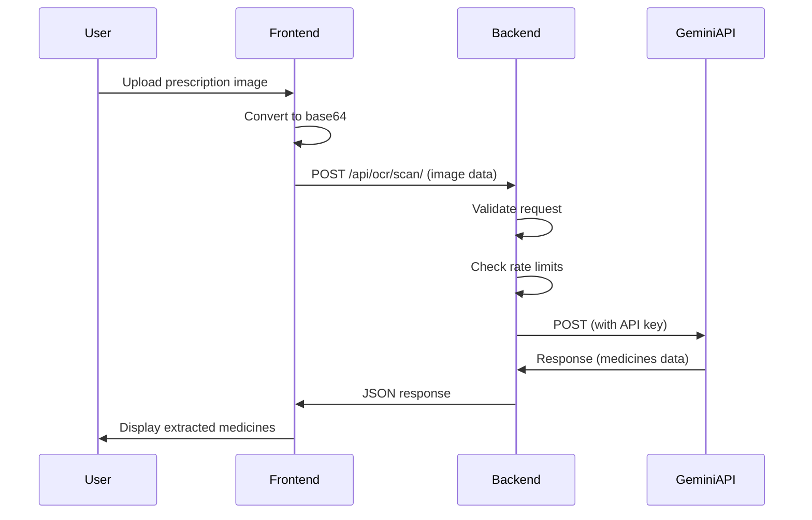

# Gemini API Security Plan

## Problem Statement

The Gemini API key is currently hardcoded in the frontend JavaScript file (`frontend/ocr.js`), which exposes it publicly when the code is deployed or pushed to GitHub. This has already resulted in API keys being banned by Google.

## Current Architecture (Insecure)

```
Frontend (Browser) → Direct Call → Gemini API
                        ↓
                  API Key Exposed!
```

## Proposed Architecture (Secure)

```
Frontend (Browser) → Backend Proxy → Gemini API
                           ↓
                     API Key Hidden
```

## Security Best Practices (Based on Research)

### 1. Never expose API keys in frontend code
- ❌ Hardcoded API keys in JavaScript
- ❌ API keys in query parameters
- ✅ API keys stored in backend environment variables
- ✅ Backend acts as a proxy to hide credentials

### 2. Add API Key Restrictions (Google Cloud Console)
- Restrict to specific HTTP referrers (for development)
- Restrict to specific IP addresses (for production)
- Restrict to specific APIs (Generative Language API only)
- Enable application restrictions

### 3. Implement Rate Limiting
- Prevent abuse by limiting requests per user/IP
- Prevent quota exhaustion from malicious users
- Example: 100 requests per 15 minutes per IP

### 4. Request Validation & Sanitization
- Validate image size and format
- Sanitize prompt text
- Add content length limits
- Prevent injection attacks

### 5. Error Handling & Logging
- Log all API calls for monitoring
- Don't expose internal errors to frontend
- Implement proper error responses
- Set up alerts for unusual activity

### 6. Environment Variable Management
- Use `.env` files for local development
- Use platform-specific environment variables for production
- Never commit `.env` files to version control
- Use different keys for development and production

## Implementation Plan

### Phase 1: Backend Proxy Endpoint

**File: `backend/medicines/views.py`**

Add a new view function to proxy OCR requests:

```python
@csrf_exempt
@login_required
@require_http_methods(["POST"])
def ocr_scan_prescription(request):
    """
    Proxy endpoint for Gemini OCR API calls.
    Frontend sends image data, backend adds API key and calls Gemini API.
    """
    try:
        # Validate request
        data = json.loads(request.body)
        image_data = data.get('image')
        model = data.get('model', 'gemini-flash-latest')
        
        if not image_data:
            return JsonResponse({
                'success': False,
                'error': 'No image data provided'
            }, status=400)
        
        # Validate image size (max 10MB)
        if len(image_data) > 10 * 1024 * 1024:
            return JsonResponse({
                'success': False,
                'error': 'Image size exceeds 10MB limit'
            }, status=400)
        
        # Call Gemini API with server-side API key
        api_key = settings.GEMINI_API_KEY
        if not api_key:
            return JsonResponse({
                'success': False,
                'error': 'API key not configured on server'
            }, status=500)
        
        # Make API call
        response = requests.post(
            f'https://generativelanguage.googleapis.com/v1beta/models/{model}:generateContent?key={api_key}',
            headers={'Content-Type': 'application/json'},
            json={
                'contents': [{
                    'parts': [
                        {'inline_data': {'mime_type': 'image/jpeg', 'data': image_data}},
                        {'text': get_ocr_prompt()}
                    ]
                }],
                'safetySettings': [
                    {'category': 'HARM_CATEGORY_HARASSMENT', 'threshold': 'BLOCK_NONE'},
                    {'category': 'HARM_CATEGORY_HATE_SPEECH', 'threshold': 'BLOCK_NONE'},
                    {'category': 'HARM_CATEGORY_SEXUALLY_EXPLICIT', 'threshold': 'BLOCK_NONE'},
                    {'category': 'HARM_CATEGORY_DANGEROUS_CONTENT', 'threshold': 'BLOCK_NONE'}
                ]
            },
            timeout=30
        )
        
        if response.status_code == 200:
            return JsonResponse({
                'success': True,
                'data': response.json()
            })
        else:
            return JsonResponse({
                'success': False,
                'error': f'API request failed: {response.status_code}'
            }, status=response.status_code)
            
    except requests.Timeout:
        return JsonResponse({
            'success': False,
            'error': 'Request timeout. Please try again.'
        }, status=504)
    except Exception as e:
        logger.error(f'OCR proxy error: {str(e)}')
        return JsonResponse({
            'success': False,
            'error': 'Internal server error'
        }, status=500)
```

### Phase 2: Frontend Updates

**File: `frontend/ocr.js`**

1. Remove hardcoded API key
2. Update `scanPrescription()` to call backend proxy:

```javascript
async function scanPrescription() {
    const imageData = ocrModal.dataset.imageData;
    if (!imageData) {
        alert('Please select an image first');
        return;
    }
    
    showScanningOverlay();
    
    try {
        const base64Data = imageData.split(',')[1];
        const mimeType = imageData.substring(5, imageData.indexOf(';'));
        
        // Try models in order
        const modelsToTry = ["gemini-flash-latest", "gemini-2.5-flash", "gemini-2.0-flash", "gemini-1.5-flash"];
        
        let success = false;
        let finalData = null;
        
        for (const modelName of modelsToTry) {
            if (success) break;
            
            console.log(`Attempting OCR with model: ${modelName}...`);
            
            try {
                // Call backend proxy instead of direct API
                const response = await fetch('/api/ocr/scan/', {
                    method: 'POST',
                    headers: {
                        'Content-Type': 'application/json',
                        'X-CSRFToken': getCookie('csrftoken')
                    },
                    body: JSON.stringify({
                        image: base64Data,
                        model: modelName
                    })
                });
                
                if (!response.ok) {
                    const err = await response.json();
                    throw new Error(err.error || response.statusText);
                }
                
                const result = await response.json();
                finalData = extractMedicineData(result.data);
                
                if (finalData) {
                    success = true;
                }
                
            } catch (innerError) {
                console.error(`Attempt failed for ${modelName}:`, innerError);
            }
        }
        
        hideScanningOverlay();
        
        if (success && finalData && finalData.length > 0) {
            console.log("OCR Success! Found", finalData.length, "medicines");
            showExtractedMedicinesModal(finalData);
            closeOCRModal();
        } else if (success && finalData && finalData.length === 0) {
            hideScanningOverlay();
            alert("No medicines were detected in the image. Please try with a clearer prescription image.");
        } else {
            alert("OCR Failed. Please try again or contact support if the issue persists.");
        }
        
    } catch (fatalError) {
        hideScanningOverlay();
        console.error('Fatal OCR Error:', fatalError);
        alert(`System Error: ${fatalError.message}`);
    }
}
```

### Phase 3: Rate Limiting

**File: `backend/medlist_backend/settings.py`**

Add Django REST Framework throttling:

```python
# Add to INSTALLED_APPS
INSTALLED_APPS = [
    # ... existing apps
    'rest_framework',
]

# Add rate limiting settings
REST_FRAMEWORK = {
    'DEFAULT_THROTTLE_CLASSES': [
        'rest_framework.throttling.AnonRateThrottle',
        'rest_framework.throttling.UserRateThrottle'
    ],
    'DEFAULT_THROTTLE_RATES': {
        'anon': '100/day',
        'user': '200/day',
    }
}
```

### Phase 4: URL Configuration

**File: `backend/medlist_backend/urls.py`**

Add the new endpoint:

```python
from medicines.views import ocr_scan_prescription

urlpatterns = [
    # ... existing URLs
    path('api/ocr/scan/', ocr_scan_prescription, name='ocr_scan'),
]
```

### Phase 5: Google Cloud Console Configuration

1. **Go to Google Cloud Console** → APIs & Services → Credentials
2. **Create a new API key** (or edit existing one)
3. **Set Application Restrictions:**
   - For development: HTTP referrers → `http://127.0.0.1:*`, `http://localhost:*`
   - For production: IP addresses → Your server IP
4. **Set API Restrictions:**
   - Select only "Generative Language API"
5. **Enable billing alerts** to detect unusual usage
6. **Set quotas** to prevent unexpected charges

### Phase 6: Environment Variables

**File: `backend/.env`** (Local Development)

```env
GEMINI_API_KEY=your-actual-api-key-here
```

**Production Deployment:**
- PythonAnywhere: Set in "Web" app → "Variables" section
- Render: Set in Environment Variables
- Railway: Set in Variables tab
- Fly.io: Set using `flyctl secrets set GEMINI_API_KEY=xxx`

### Phase 7: Additional Security Measures

1. **CSRF Protection** - Already enabled in Django
2. **Authentication Required** - OCR endpoint requires login
3. **Input Validation** - Validate image size and format
4. **Error Logging** - Log all proxy calls for monitoring
5. **HTTPS Only** - Enforce HTTPS in production
6. **Content Security Policy** - Add CSP headers

## Migration Steps

1. ✅ Create backend proxy endpoint
2. ✅ Update frontend to use proxy
3. ✅ Remove API key from frontend code
4. ✅ Add rate limiting
5. ✅ Update Google Cloud Console restrictions
6. ✅ Test locally with environment variable
7. ✅ Deploy to production
8. ✅ Verify API key is not exposed in browser
9. ✅ Monitor usage and set up alerts

## Security Checklist

- [ ] API key stored in backend environment variable
- [ ] Frontend code contains no API keys
- [ ] API key has application restrictions in Google Cloud
- [ ] API key has API restrictions (Generative Language only)
- [ ] Rate limiting is enabled
- [ ] CSRF protection is enabled
- [ ] Authentication is required for OCR endpoint
- [ ] Input validation is implemented
- [ ] Error logging is configured
- [ ] HTTPS is enforced in production
- [ ] Billing alerts are set up
- [ ] `.env` file is in `.gitignore`
- [ ] Different keys for dev and production

## Diagram



## References

1. [Google Cloud API Key Best Practices](https://docs.cloud.google.com/docs/authentication/api-keys-best-practices)
2. [How Google AI Studio Proxies Gemini Requests](https://glaforge.dev/posts/2026/02/09/decoded-how-google-ai-studio-securely-proxies-gemini-api-requests/)
3. [Django REST Framework Throttling](https://www.django-rest-framework.org/api-guide/throttling/)
