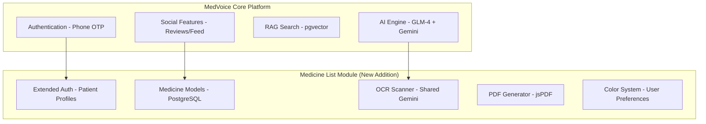

# Medicine List Generator - Reorganization & Merge Plan

## Executive Summary

This plan outlines the reorganization of the `medicineList_generator` project to prepare it for integration as a module within the `MedVoice` healthcare review platform. The reorganization focuses on cleaning up documentation, restructuring directories, and preparing the codebase for seamless merging.

---

## 1. Current State Analysis

### 1.1 Current Project Structure

```
medicineList_generator/
├── Root .md files (22 files) - Disorganized
├── backend/
│   ├── Django 5.0.1 application
│   ├── medicines/ app (models, views, admin)
│   ├── medlist_backend/ (settings, urls, wsgi, asgi)
│   ├── .md files (6 files) - Mixed with code
│   └── db.sqlite3 (development database)
├── frontend/
│   ├── Vanilla JS + HTML + CSS
│   ├── med_list_generator/ (duplicate structure)
│   └── README.md
├── plans/ (3 security/fixes plans)
└── screenshots/
```

### 1.2 MedVoice Project Stack

- **Backend**: Django 5 + Django REST Framework
- **Database**: PostgreSQL with pgvector
- **Async Tasks**: Celery + Redis
- **AI**: GLM-4 + Gemini API (Flash + Embeddings)
- **Frontend**: Django Templates + Vanilla JS
- **Media**: Cloudflare R2
- **Authentication**: Phone OTP / Username-Password / Google OAuth

### 1.3 Integration Points

| Feature | medicineList_generator | MedVoice | Integration Strategy |
|---------|------------------------|----------|---------------------|
| Framework | Django 5.0.1 | Django 5 | Compatible - merge as Django app |
| Database | SQLite/MySQL | PostgreSQL + pgvector | Migrate models to PostgreSQL |
| AI API | Gemini 2.5 Flash | Gemini Flash + Embeddings | Shared API configuration |
| Auth | Django built-in | Phone OTP + Django Auth | Extend MedVoice auth system |
| OCR | Prescription scanning | Prescription verification | Share OCR module |
| Frontend | Vanilla JS | Vanilla JS + Django Templates | Merge templates and static files |

---

## 2. File Reorganization Plan

### 2.1 New Directory Structure

```
medicineList_generator/
├── docs/                          # All documentation
│   ├── architecture/              # Architecture & design docs
│   │   ├── PROJECT_ARCHITECTURE.md
│   │   └── PROJECT_FEATURES_AND_TASKS.md
│   ├── deployment/                # Deployment guides
│   │   ├── DEPLOYMENT_GUIDE_RENDER.md
│   │   ├── DEPLOYMENT_GUIDE_FLYIO.md
│   │   ├── DEPLOYMENT_GUIDE_PYTHONANYWHERE.md
│   │   └── HOSTING_COMPARISON.md
│   ├── operations/                # Operational guides
│   │   ├── LOCAL_SETUP_GUIDE.md
│   │   ├── GIT_BRANCH_WORKFLOW.md
│   │   └── ENVIRONMENT_VARIABLES_GUIDE.md
│   ├── security/                 # Security documentation
│   │   ├── SECURITY_IMPLEMENTATION_SUMMARY.md
│   │   └── PROJECT_SECURITY_ANALYSIS_REPORT.md
│   ├── production/               # Production-related docs
│   │   ├── PRODUCTION_READINESS_CHECKLIST.md
│   │   ├── PRODUCTION_READINESS_ASSESSMENT.md
│   │   ├── PRODUCTION_ISSUES_ANALYSIS.md
│   │   └── PRODUCTION_FIXES_SUMMARY.md
│   ├── issues/                   # Issue tracking & fixes
│   │   ├── ISSUES_FIXED.md
│   │   ├── DATA_ISOLATION_FIX.md
│   │   └── FIX_STATIC_FILES_ISSUE.md
│   └── legacy/                   # Deprecated/obsolete docs
│       ├── DEPLOYMENT_SUMMARY.md
│       ├── FLYIO_DEPLOYMENT_ROADMAP.md
│       ├── PYTHONANYWHERE_DEPLOYMENT_GUIDE.md
│       ├── PYTHONANYWHERE_NEXT_STEPS.md
│       ├── QUICK_START_DEPLOYMENT.md
│       ├── ROOCODE_CHECKPOINT_GUIDE.md
│       ├── AI_AUTOMATED_DEPLOYMENT.md
│       ├── PUSH_GIT_UPDATES.md
│       ├── PYTHONANYWHERE_MANUAL_CONFIG_STEPS.md
│       └── PYTHONANYWHERE_MYSQL_DEPLOYMENT.md
├── backend/
│   ├── manage.py
│   ├── requirements.txt
│   ├── Procfile
│   ├── .env.example
│   ├── .gitignore
│   ├── medlist_backend/           # Django project settings
│   │   ├── __init__.py
│   │   ├── settings.py
│   │   ├── urls.py
│   │   ├── wsgi.py
│   │   └── asgi.py
│   └── medicines/                 # Main Django app
│       ├── __init__.py
│       ├── apps.py
│       ├── admin.py
│       ├── models.py
│       ├── views.py
│       ├── tests.py
│       └── migrations/
├── frontend/
│   ├── static/                    # Static assets
│   │   ├── css/
│   │   │   └── styles.css
│   │   └── js/
│   │       ├── auth.js
│   │       ├── script.js
│   │       ├── medicines.js
│   │       ├── ocr.js
│   │       ├── colors.js
│   │       └── config.js
│   └── templates/                 # Django templates
│       ├── index.html
│       ├── login.html
│       └── base.html (new)
├── plans/                         # Active implementation plans
│   ├── CRITICAL_FIXES_IMPLEMENTATION_PLAN.md
│   ├── GEMINI_API_SECURITY_PLAN.md
│   └── PROJECT_SECURITY_ANALYSIS_REPORT.md
├── scripts/                       # Utility scripts (new)
│   └── create_test_user.py
└── .gitignore
```

### 2.2 Files to Remove

| File | Reason |
|------|--------|
| `frontend/med_list_generator/` | Duplicate structure - not used |
| `backend/db.sqlite3` | Development database - should be in .gitignore |
| `backend/.env` | Contains secrets - should be in .gitignore |
| `backend/create_test_user.py` | Move to `scripts/` directory |
| Git-tracked deleted files | Already marked for deletion in git status |

### 2.3 File Migration Matrix

| From | To | Action |
|------|-----|--------|
| Root .md files | `docs/` subdirectories | Move & categorize |
| Backend .md files | `docs/operations/` | Move |
| `backend/create_test_user.py` | `scripts/create_test_user.py` | Move |
| `frontend/*.js` | `frontend/static/js/` | Move |
| `frontend/*.css` | `frontend/static/css/` | Move |
| `frontend/*.html` | `frontend/templates/` | Move |

---

## 3. Merge Strategy for MedVoice Integration

### 3.1 Integration Architecture



### 3.2 Django App Structure After Merge

```
medvoice_project/
├── core/                          # Core MedVoice app
│   ├── models.py (User, Review, Doctor, Hospital, etc.)
│   ├── views.py
│   └── ...
├── social/                        # Social features app
│   ├── models.py (Post, Comment, Vote)
│   └── ...
├── ai_services/                   # AI integration app
│   ├── gemini_service.py
│   ├── glm_service.py
│   └── ...
├── medicine_list/                 # NEW: medicineList_generator as app
│   ├── models.py (Patient, UserMedicine, UserColorPreferences)
│   ├── views.py (Medicine CRUD, OCR, PDF)
│   ├── urls.py
│   ├── admin.py
│   └── ...
├── templates/
│   ├── core/
│   ├── social/
│   └── medicine_list/
└── static/
    ├── css/
    ├── js/
    └── ...
```

### 3.3 Model Migration Strategy

| Current Model | MedVoice Integration | Changes Required |
|---------------|---------------------|------------------|
| `User` (Django) | Extend MedVoice User | Add medicine list fields |
| `Patient` | Link to User | Keep as OneToOne to User |
| `UserMedicine` | New model | Add to medicine_list app |
| `UserColorPreferences` | New model | Add to medicine_list app |
| `GlobalMedicine` | New model | Add to medicine_list app |

### 3.4 API Endpoint Design

```
/api/medicine-list/
├── POST   /api/medicine-list/patients/          # Create patient profile
├── GET    /api/medicine-list/patients/{id}/     # Get patient info
├── PUT    /api/medicine-list/patients/{id}/     # Update patient
├── GET    /api/medicine-list/medicines/         # List medicines
├── POST   /api/medicine-list/medicines/         # Add medicine
├── PUT    /api/medicine-list/medicines/{id}/   # Update medicine
├── DELETE /api/medicine-list/medicines/{id}/   # Delete medicine
├── POST   /api/medicine-list/ocr/scan/          # OCR prescription
├── POST   /api/medicine-list/pdf/generate/      # Generate PDF
└── GET    /api/medicine-list/colors/            # Get color preferences
```

---

## 4. Configuration Changes for MedVoice

### 4.1 Settings Updates

```python
# settings.py additions for medicine list module

INSTALLED_APPS += [
    'rest_framework',
    'medicine_list',  # New app
]

# Shared AI services
GEMINI_API_KEY = config('GEMINI_API_KEY')
GLM_API_KEY = config('GLM_API_KEY')

# Database - PostgreSQL (shared)
DATABASES = {
    'default': {
        'ENGINE': 'django.db.backends.postgresql',
        'NAME': config('DB_NAME'),
        'USER': config('DB_USER'),
        'PASSWORD': config('DB_PASSWORD'),
        'HOST': config('DB_HOST'),
        'PORT': config('DB_PORT', '5432'),
    }
}

# Static files - Whitenoise (shared)
STATICFILES_STORAGE = 'whitenoise.storage.CompressedManifestStaticFilesStorage'

# Celery for async OCR processing
CELERY_BROKER_URL = config('REDIS_URL')
CELERY_RESULT_BACKEND = config('REDIS_URL')
```

### 4.2 URL Configuration

```python
# urls.py - Main project URLs

urlpatterns = [
    # MedVoice core URLs
    path('api/social/', include('social.urls')),
    path('api/ai/', include('ai_services.urls')),
    
    # Medicine list module URLs
    path('api/medicine-list/', include('medicine_list.urls')),
    
    # Frontend templates
    path('medicine-list/', include('medicine_list.template_urls')),
]
```

---

## 5. Implementation Steps

### Phase 1: Cleanup & Reorganization (Current Project)

1. **Create new directory structure**
   - Create `docs/` with subdirectories
   - Create `frontend/static/` with `css/` and `js/`
   - Create `frontend/templates/`
   - Create `scripts/` directory

2. **Move files to new locations**
   - Move all .md files to appropriate `docs/` subdirectories
   - Move frontend files to `static/` and `templates/`
   - Move `create_test_user.py` to `scripts/`

3. **Remove unnecessary files**
   - Delete `frontend/med_list_generator/` directory
   - Remove `backend/db.sqlite3` (add to .gitignore)
   - Remove `backend/.env` (add to .gitignore)
   - Clean up git-tracked deleted files

4. **Update .gitignore**
   ```
   # Add to .gitignore
   backend/db.sqlite3
   backend/.env
   backend/__pycache__/
   frontend/__pycache__/
   *.pyc
   .DS_Store
   ```

5. **Update references**
   - Update paths in `settings.py` for templates
   - Update import paths in Python files
   - Update static file references in templates

### Phase 2: Prepare for MedVoice Merge

1. **Refactor Django app structure**
   - Ensure `medicines` app is self-contained
   - Add `__init__.py` to all directories
   - Create `medicine_list/urls.py` for URL routing

2. **Update models for PostgreSQL**
   - Review all models for PostgreSQL compatibility
   - Add any missing indexes
   - Prepare migration files

3. **Create integration documentation**
   - Document API endpoints
   - Document model relationships
   - Document shared services (OCR, AI)

4. **Extract shared services**
   - Create `ai_services/` module for Gemini API calls
   - Create `utils/` for shared utilities

### Phase 3: Merge into MedVoice

1. **Copy medicine_list app to MedVoice**
   - Copy `backend/medicines/` to MedVoice as `medicine_list/`
   - Copy frontend templates to MedVoice templates
   - Copy static files to MedVoice static

2. **Update MedVoice settings**
   - Add `medicine_list` to `INSTALLED_APPS`
   - Configure shared database settings
   - Configure shared AI API keys

3. **Run migrations**
   - Create migrations for new models
   - Apply migrations to PostgreSQL database

4. **Update authentication**
   - Extend MedVoice User model with Patient profile
   - Update login/register views to use MedVoice auth

5. **Test integration**
   - Test all API endpoints
   - Test OCR functionality with shared Gemini service
   - Test PDF generation
   - Test color preferences

---

## 6. Benefits of This Approach

### 6.1 Immediate Benefits (Current Project)
- **Cleaner structure**: All documentation organized in logical directories
- **Easier navigation**: Clear separation of concerns
- **Reduced confusion**: No more scattered .md files
- **Better maintainability**: Clear file locations

### 6.2 Long-term Benefits (MedVoice Integration)
- **Modular architecture**: Medicine list as independent Django app
- **Shared services**: OCR, AI, authentication shared across platform
- **Consistent stack**: Both projects use Django 5
- **Scalable design**: Easy to add more modules in future
- **Code reuse**: Shared utilities and services

---

## 7. Risk Assessment

| Risk | Impact | Mitigation |
|------|--------|------------|
| Breaking existing functionality | High | Test thoroughly after reorganization |
| Path references breaking | Medium | Update all references systematically |
| Database migration issues | Medium | Prepare migrations carefully, test on staging |
| Authentication conflicts | Medium | Use MedVoice auth system, extend as needed |
| API endpoint conflicts | Low | Use namespace prefixes (`/api/medicine-list/`) |

---

## 8. Success Criteria

- [ ] All .md files organized in `docs/` subdirectories
- [ ] No duplicate or unnecessary files remain
- [ ] Frontend files properly separated (static/ vs templates/)
- [ ] Git repository clean (no tracked deleted files)
- [ ] Medicine list app is self-contained and portable
- [ ] Integration documentation complete
- [ ] All tests pass after reorganization
- [ ] Ready to merge into MedVoice project

---

## 9. Next Steps

1. **Review this plan** with stakeholders
2. **Approve reorganization** approach
3. **Execute Phase 1** (Cleanup & Reorganization)
4. **Execute Phase 2** (Prepare for Merge)
5. **Coordinate with MedVoice team** for Phase 3
6. **Test integration** thoroughly
7. **Deploy** merged application

---

## Appendix A: File Classification

### Architecture & Design
- `PROJECT_ARCHITECTURE.md`
- `PROJECT_FEATURES_AND_TASKS.md`

### Deployment Guides
- `DEPLOYMENT_GUIDE_RENDER.md`
- `DEPLOYMENT_GUIDE_FLYIO.md`
- `DEPLOYMENT_GUIDE_PYTHONANYWHERE.md`
- `HOSTING_COMPARISON.md`

### Operational Guides
- `LOCAL_SETUP_GUIDE.md`
- `GIT_BRANCH_WORKFLOW.md`
- `ENVIRONMENT_VARIABLES_GUIDE.md`

### Security Documentation
- `SECURITY_IMPLEMENTATION_SUMMARY.md`
- `PROJECT_SECURITY_ANALYSIS_REPORT.md`

### Production-Related
- `PRODUCTION_READINESS_CHECKLIST.md`
- `PRODUCTION_READINESS_ASSESSMENT.md`
- `PRODUCTION_ISSUES_ANALYSIS.md`
- `PRODUCTION_FIXES_SUMMARY.md`

### Issue Tracking & Fixes
- `ISSUES_FIXED.md`
- `DATA_ISOLATION_FIX.md`
- `FIX_STATIC_FILES_ISSUE.md`

### Legacy/Deprecated
- `DEPLOYMENT_SUMMARY.md`
- `FLYIO_DEPLOYMENT_ROADMAP.md`
- `PYTHONANYWHERE_DEPLOYMENT_GUIDE.md`
- `PYTHONANYWHERE_NEXT_STEPS.md`
- `QUICK_START_DEPLOYMENT.md`
- `ROOCODE_CHECKPOINT_GUIDE.md`
- `AI_AUTOMATED_DEPLOYMENT.md`
- `PUSH_GIT_UPDATES.md`
- `PYTHONANYWHERE_MANUAL_CONFIG_STEPS.md`
- `PYTHONANYWHERE_MYSQL_DEPLOYMENT.md`

---

*Document Version: 1.0*
*Created: 2026-03-11*
*Status: Draft - Pending Review*
