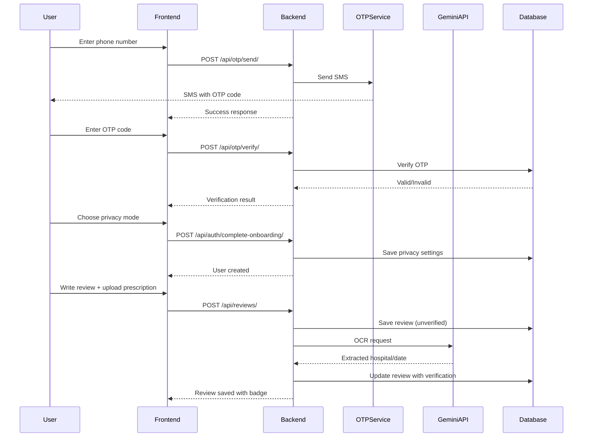

# MedVoice BD - User Profile Privacy System

## Executive Summary

This document outlines the implementation of a hybrid user profile system that separates **Backend Accountability** from **Frontend Privacy**. Users can choose between displaying their real name or a pseudonym, while the platform maintains traceability through phone number-based OTP authentication. The trust anchor is provided by the existing Gemini API OCR verification system, which can stamp anonymous reviews with a "Verified Patient" badge.

---

## Architecture Overview

### System Design Philosophy

```
                    +---------------------+
                    |   User Experience   |
                    |   (Frontend Layer)  |
                    +---------------------+
                               |
                               | Privacy Choice
                               v
        +----------------------+----------------------+
        |                     |                      |
  Display Real Name    Display Pseudonym    Display Anonymous
        |                     |                      |
        v                     v                      v
+----------------+   +----------------+   +----------------+
| "John Doe"     |   | "HealthHero88" |   | "MedVoice User"|
+----------------+   +----------------+   +----------------+
        |                     |                      |
        +---------------------+----------------------+
                              |
                              | All routes lead to...
                              v
                    +---------------------+
                    |   Backend Layer     |
                    |  (Accountability)  |
                    +---------------------+
                               |
                               | Phone Number (Always Stored)
                               v
                    +---------------------+
                    |  +880 1712-345678  |
                    +---------------------+
                               |
                               | OCR Verification
                               v
                    +---------------------+
                    |  Verified Patient   |
                    |      Badge         |
                    +---------------------+
```

### Key Principles

1. **Backend Accountability**: Phone number OTP ensures every account is traceable
2. **Frontend Privacy**: Users control how they appear to others
3. **Trust Anchor**: OCR-verified prescriptions provide credibility regardless of anonymity

---

## Phase 1: Backend Model Updates

### 1.1 Patient Model Extensions

**File**: `medicineList/backend/medicines/models.py`

```python
class Patient(BaseModel):
    """Patient profile linked to Django User"""
    user = models.OneToOneField(settings.AUTH_USER_MODEL, on_delete=models.CASCADE, primary_key=True)
    age = models.IntegerField()
    email = models.EmailField(blank=True, null=True)
    
    # NEW FIELDS FOR PRIVACY SYSTEM
    phone_number = models.CharField(max_length=20, unique=True, db_index=True)
    display_name = models.CharField(max_length=100, blank=True, null=True)
    is_anonymous = models.BooleanField(default=False)
    
    def __str__(self):
        return self.user.username
    
    class Meta:
        db_table = 'patients'
        verbose_name = "Patient"
        verbose_name_plural = "Patients"
        ordering = ['-created_at']
```

### 1.2 OTP Verification Model

**File**: `medicineList/backend/medicines/models.py`

```python
class OTPVerification(BaseModel):
    """Store OTP codes for phone verification"""
    phone_number = models.CharField(max_length=20, db_index=True)
    code = models.CharField(max_length=6)
    expires_at = models.DateTimeField()
    is_verified = models.BooleanField(default=False)
    attempts = models.IntegerField(default=0)
    
    def is_valid(self):
        """Check if OTP is still valid and not expired"""
        from django.utils import timezone
        return (
            not self.is_verified and 
            self.attempts < 3 and 
            self.expires_at > timezone.now()
        )
    
    class Meta:
        db_table = 'otp_verifications'
        verbose_name = "OTP Verification"
        ordering = ['-created_at']
```

### 1.3 Review Model

**File**: `medicineList/backend/medicines/models.py`

```python
class Review(BaseModel):
    """User reviews for doctors and facilities"""
    patient = models.ForeignKey(Patient, on_delete=models.CASCADE, related_name='reviews')
    doctor_name = models.CharField(max_length=255, blank=True, null=True)
    facility_name = models.CharField(max_length=255, blank=True, null=True)
    specialty = models.CharField(max_length=100, blank=True, null=True)
    rating = models.IntegerField(choices=[(i, i) for i in range(1, 6)])
    content = models.TextField()
    is_verified = models.BooleanField(default=False)
    
    def get_display_author(self):
        """Return author name based on privacy settings"""
        if self.patient.is_anonymous:
            return "MedVoice User"
        elif self.patient.display_name:
            return self.patient.display_name
        else:
            return self.patient.user.get_full_name() or self.patient.user.username
    
    class Meta:
        db_table = 'reviews'
        verbose_name = "Review"
        verbose_name_plural = "Reviews"
        ordering = ['-created_at']
```

### 1.4 Prescription Verification Model

**File**: `medicineList/backend/medicines/models.py`

```python
class PrescriptionVerification(BaseModel):
    """Link reviews to verified prescriptions"""
    review = models.OneToOneField(Review, on_delete=models.CASCADE, related_name='verification')
    image_url = models.URLField(max_length=500)
    extracted_hospital = models.CharField(max_length=255)
    extracted_date = models.DateField()
    verified_at = models.DateTimeField(auto_now_add=True)
    
    class Meta:
        db_table = 'prescription_verifications'
        verbose_name = "Prescription Verification"
        ordering = ['-verified_at']
```

---

## Phase 2: OTP Authentication System

### 2.1 OTP Service Provider Options

| Provider | Pros | Cons | Recommendation |
|----------|------|------|----------------|
| **Twilio** | Reliable, global coverage, good documentation | Higher cost per SMS | Best for production |
| **Firebase Auth** | Free tier, easy integration | Limited to Firebase ecosystem | Good for MVP |
| **Local SMS Gateway** | No external dependency, cost-effective | Requires telecom partnership | Best for BD market |

**Recommended for Bangladesh**: Use a local SMS gateway provider (e.g., Robi/Airtel, Banglalink API) for cost-effectiveness and reliability.

### 2.2 OTP API Endpoints

#### Generate and Send OTP

**Endpoint**: `POST /api/otp/send/`

**Request**:
```json
{
  "phone_number": "+8801712345678"
}
```

**Response**:
```json
{
  "success": true,
  "message": "OTP sent successfully",
  "expires_in": 300
}
```

**Rate Limiting**: Max 3 requests per phone number per hour

**IMPORTANT**: Rate limiting MUST be implemented at the API gateway level using Redis BEFORE the request hits the database. This is critical to prevent SMS bombing attacks that would drain the SMS API budget.

See [Section 2.5: Redis-Based Rate Limiting](#25-redis-based-rate-limiting) for detailed implementation.

#### Verify OTP

**Endpoint**: `POST /api/otp/verify/`

**Request**:
```json
{
  "phone_number": "+8801712345678",
  "code": "123456"
}
```

**Response**:
```json
{
  "success": true,
  "verified": true,
  "message": "Phone number verified"
}
```

#### Login/Register with OTP

**Endpoint**: `POST /api/auth/otp-login/`

**Request**:
```json
{
  "phone_number": "+8801712345678",
  "otp_code": "123456",
  "display_name": "HealthHero88",
  "is_anonymous": false
}
```

**Response**:
```json
{
  "success": true,
  "message": "Login successful",
  "user": {
    "id": 123,
    "display_name": "HealthHero88",
    "is_anonymous": false
  }
}
```

---

### 2.5 Redis-Based Rate Limiting

**CRITICAL SECURITY REQUIREMENT**: Rate limiting MUST be implemented at the API gateway level using Redis BEFORE the request hits the database. This is essential to prevent SMS bombing attacks that would drain the SMS API budget.

#### Why Redis at API Gateway Level?

```
Without Redis (Database-Level Rate Limiting):
┌─────────────┐    ┌──────────────┐    ┌─────────────┐
│   Client    │ -> │  Django App   │ -> │  Database   │
│             │    │              │    │             │
│ 1000 req/s  │    │  Check DB    │    │  Count req  │
└─────────────┘    └──────────────┘    └─────────────┘
       │                   │                   │
       v                   v                   v
   SMS API hit!      DB overloaded      SMS API hit!
   (Cost: $500)    (Slow queries)    (Cost: $500)

With Redis (API Gateway-Level Rate Limiting):
┌─────────────┐    ┌──────────────┐    ┌─────────────┐
│   Client    │ -> │  Redis Cache  │ -> │  Django App   │
│             │    │              │    │              │
│ 1000 req/s  │    │  Check limit  │    │  Only 3 req │
└─────────────┘    └──────────────┘    └─────────────┘
       │                   │                   │
       v                   v                   v
   997 blocked      Instant check      3 SMS sent
   (Cost: $0)      (0.1ms)           (Cost: $0.03)
```

#### Implementation Architecture

**File**: `medicineList/backend/utils/rate_limiter.py`

```python
import redis
from django.conf import settings
from functools import wraps
from django.http import JsonResponse
import time

class RedisRateLimiter:
    """
    Redis-based rate limiter for API gateway level protection.
    Prevents SMS bombing attacks before they hit the database.
    """
    
    def __init__(self):
        self.redis_client = redis.Redis(
            host=settings.REDIS_HOST,
            port=settings.REDIS_PORT,
            db=settings.REDIS_DB,
            decode_responses=True
        )
    
    def is_allowed(self, key: str, limit: int, window: int) -> tuple[bool, dict]:
        """
        Check if request is allowed within rate limit.
        
        Args:
            key: Unique identifier (e.g., phone number or IP)
            limit: Maximum requests allowed
            window: Time window in seconds
            
        Returns:
            tuple: (allowed: bool, info: dict)
        """
        current_time = int(time.time())
        window_start = current_time - window
        
        # Redis key for this rate limit
        redis_key = f"ratelimit:{key}"
        
        # Use Redis pipeline for atomic operations
        pipe = self.redis_client.pipeline()
        
        # Remove old entries outside the window
        pipe.zremrangebyscore(redis_key, 0, window_start)
        
        # Count current requests in window
        pipe.zcard(redis_key)
        
        # Add current request
        pipe.zadd(redis_key, {str(current_time): current_time})
        
        # Set expiration (cleanup old keys)
        pipe.expire(redis_key, window)
        
        results = pipe.execute()
        
        request_count = results[1]
        allowed = request_count < limit
        
        return allowed, {
            'count': request_count,
            'limit': limit,
            'window': window,
            'remaining': max(0, limit - request_count - 1)
        }

# Singleton instance
rate_limiter = RedisRateLimiter()

def rate_limit(key_func, limit: int = 3, window: int = 3600):
    """
    Decorator for rate limiting API endpoints.
    
    Args:
        key_func: Function to extract rate limit key from request
        limit: Maximum requests allowed
        window: Time window in seconds (default: 1 hour)
    """
    def decorator(view_func):
        @wraps(view_func)
        def wrapped_view(request, *args, **kwargs):
            # Extract key (phone number for OTP endpoints)
            key = key_func(request)
            
            # Check rate limit
            allowed, info = rate_limiter.is_allowed(key, limit, window)
            
            if not allowed:
                # Return 429 Too Many Requests
                return JsonResponse({
                    'success': False,
                    'error': 'Too many requests',
                    'message': f'Please wait before trying again',
                    'retry_after': info['window'] - (int(time.time()) % info['window'])
                }, status=429)
            
            # Add rate limit headers
            response = view_func(request, *args, **kwargs)
            response['X-RateLimit-Limit'] = str(info['limit'])
            response['X-RateLimit-Remaining'] = str(info['remaining'])
            response['X-RateLimit-Window'] = str(info['window'])
            
            return response
        
        return wrapped_view
    return decorator
```

#### Usage in OTP Endpoints

**File**: `medicineList/backend/medicines/views.py`

```python
from utils.rate_limiter import rate_limit

def get_phone_from_request(request):
    """Extract phone number from request"""
    if request.method == 'POST':
        data = json.loads(request.body)
        return data.get('phone_number', '')
    return ''

@csrf_exempt
@rate_limit(key_func=get_phone_from_request, limit=3, window=3600)
def send_otp(request):
    """
    Send OTP to phone number.
    Rate limited: 3 requests per phone number per hour.
    """
    # This code only executes if rate limit check passes
    # ... existing OTP sending logic ...
```

#### Redis Configuration

**File**: `medicineList/backend/medlist_backend/settings.py`

```python
# Redis Configuration for Rate Limiting
REDIS_HOST = config('REDIS_HOST', default='localhost')
REDIS_PORT = config('REDIS_PORT', default=6379, cast=int)
REDIS_DB = config('REDIS_DB', default=0, cast=int)
REDIS_PASSWORD = config('REDIS_PASSWORD', default=None)

# Rate Limiting Settings
OTP_RATE_LIMIT = config('OTP_RATE_LIMIT', default=3, cast=int)
OTP_RATE_WINDOW = config('OTP_RATE_WINDOW', default=3600, cast=int)  # 1 hour
```

**Note**: Redis is already included in [`requirements.txt`](../../backend/requirements.txt:20) as `redis==5.0.1`. No additional package installation is required for rate limiting.

#### Rate Limiting Strategy

| Endpoint | Key | Limit | Window | Purpose |
|----------|-----|-------|---------|----------|
| `POST /api/otp/send/` | Phone number | 3 | 1 hour | Prevent SMS bombing |
| `POST /api/otp/verify/` | Phone number | 10 | 1 hour | Prevent brute force |
| `POST /api/auth/otp-login/` | IP address | 5 | 15 minutes | Prevent account takeover |

#### Benefits of Redis-Based Rate Limiting

1. **Cost Protection**: Blocks SMS bombing attacks before they drain API budget
2. **Performance**: Redis checks are ~100x faster than database queries
3. **Scalability**: Handles high concurrency without database lock contention
4. **Atomic Operations**: Redis pipelines ensure thread-safe counting
5. **Automatic Cleanup**: Redis TTL automatically expires old rate limit data

#### Monitoring and Alerts

```python
# Add to rate_limiter.py
def log_rate_limit_violation(key: str, endpoint: str):
    """Log rate limit violations for monitoring"""
    logger.warning(
        f"Rate limit violation: {key} exceeded limit for {endpoint}",
        extra={
            'key': key,
            'endpoint': endpoint,
            'timestamp': time.time()
        }
    )
    # TODO: Send alert to admin dashboard or Slack
```

#### Testing Rate Limiting

```python
def test_redis_rate_limiting():
    """Test that Redis rate limiter blocks excess requests"""
    limiter = RedisRateLimiter()
    
    # First 3 requests should be allowed
    for i in range(3):
        allowed, info = limiter.is_allowed("+8801712345678", 3, 3600)
        assert allowed == True, f"Request {i+1} should be allowed"
    
    # 4th request should be blocked
    allowed, info = limiter.is_allowed("+8801712345678", 3, 3600)
    assert allowed == False, "4th request should be blocked"
    assert info['count'] == 3, "Count should be 3"
    assert info['remaining'] == 0, "Remaining should be 0"
```

---

## Phase 3: Onboarding Flow Updates

### 3.1 Onboarding Steps

```
Step 1: Phone Number Entry
┌─────────────────────────────────┐
│  Enter your phone number        │
│  [+880] [1712-345678]          │
│                                 │
│  [Send Verification Code]       │
└─────────────────────────────────┘

Step 2: OTP Verification
┌─────────────────────────────────┐
│  Enter the 6-digit code sent   │
│  to your phone                 │
│                                 │
│  [1] [2] [3]                   │
│  [4] [5] [6]                   │
│                                 │
│  Resend code in 0:59            │
└─────────────────────────────────┘

Step 3: Privacy Choice
┌─────────────────────────────────┐
│  Choose how you appear         │
│                                 │
│  ○ Display my real name         │
│  ○ Use a pseudonym             │
│  ○ Stay anonymous              │
│                                 │
│  [Display Name] _______________ │
│  (Only for pseudonym option)   │
│                                 │
│  [Continue]                     │
└─────────────────────────────────┘

Step 4: Profile Setup (Optional)
┌─────────────────────────────────┐
│  Complete your profile          │
│                                 │
│  Age: [25]                     │
│  Email: [optional]             │
│                                 │
│  [Skip for now]  [Save]        │
└─────────────────────────────────┘
```

### 3.2 Privacy Toggle UI Component

**HTML Structure**:
```html
<div class="privacy-toggle">
  <div class="privacy-option" data-value="real">
    <div class="radio-indicator"></div>
    <div class="option-content">
      <span class="option-title">Display my real name</span>
      <span class="option-desc">Your name will be visible to others</span>
    </div>
  </div>
  
  <div class="privacy-option" data-value="pseudonym">
    <div class="radio-indicator"></div>
    <div class="option-content">
      <span class="option-title">Use a pseudonym</span>
      <span class="option-desc">Choose a nickname to display</span>
    </div>
  </div>
  
  <div class="privacy-option" data-value="anonymous">
    <div class="radio-indicator"></div>
    <div class="option-content">
      <span class="option-title">Stay anonymous</span>
      <span class="option-desc">Display as "MedVoice User"</span>
    </div>
  </div>
</div>

<div class="pseudonym-input" style="display: none;">
  <label>Your pseudonym</label>
  <input type="text" placeholder="e.g., HealthHero88" maxlength="30">
</div>
```

**CSS Styling**:
```css
.privacy-toggle {
  display: flex;
  flex-direction: column;
  gap: 12px;
}

.privacy-option {
  display: flex;
  align-items: center;
  gap: 12px;
  padding: 16px;
  border: 2px solid var(--border-secondary);
  border-radius: 12px;
  cursor: pointer;
  transition: all 0.2s ease;
}

.privacy-option:hover {
  border-color: var(--accent-primary);
  background: var(--bg-elevated);
}

.privacy-option.selected {
  border-color: var(--accent-primary);
  background: rgba(255, 59, 48, 0.05);
}

.radio-indicator {
  width: 20px;
  height: 20px;
  border: 2px solid var(--border-secondary);
  border-radius: 50%;
  position: relative;
}

.privacy-option.selected .radio-indicator {
  border-color: var(--accent-primary);
}

.privacy-option.selected .radio-indicator::after {
  content: '';
  position: absolute;
  top: 50%;
  left: 50%;
  transform: translate(-50%, -50%);
  width: 10px;
  height: 10px;
  background: var(--accent-primary);
  border-radius: 50%;
}

.option-title {
  font-weight: 600;
  font-size: var(--text-base);
}

.option-desc {
  color: var(--text-tertiary);
  font-size: var(--text-sm);
}
```

---

## Phase 4: Review Model & Verification System

### 4.1 Review Creation Flow with Verification

```
User writes review
       |
       v
┌─────────────────────────────┐
│  Review submitted           │
│  (Initially unverified)     │
└─────────────────────────────┘
       |
       | Optional: Upload prescription
       v
┌─────────────────────────────┐
│  OCR Processing             │
│  (Gemini API)               │
└─────────────────────────────┘
       |
       v
┌─────────────────────────────┐
│  Extract:                   │
│  - Hospital name            │
│  - Visit date               │
│  - Medicines (optional)     │
└─────────────────────────────┘
       |
       v
┌─────────────────────────────┐
│  Match with review data?     │
└─────────────────────────────┘
       |
    +---+---+
    |       |
   Yes     No
    |       |
    v       v
┌─────────┐  ┌─────────────────┐
│ Verified │  │ Not Verified    │
│ Badge    │  │ (No badge)      │
└─────────┘  └─────────────────┘
```

### 4.2 Updated OCR Service

**File**: `medicineList/backend/ai_services/gemini_service.py`

Add new method for verification-focused OCR:

```python
def extract_verification_data(self, image_data: str, mime_type: str = 'image/jpeg') -> Dict:
    """
    Extract verification data from prescription (hospital, date).
    
    Args:
        image_data: Base64-encoded image data
        mime_type: MIME type of the image
        
    Returns:
        dict: Extracted verification data
    """
    prompt = """You are a medical prescription verification system. Extract the following information from this prescription image and return ONLY valid JSON:

{
  "hospital_name": "string (name of hospital/clinic)",
  "visit_date": "YYYY-MM-DD (date of visit)",
  "doctor_name": "string (optional, doctor's name if visible)",
  "confidence": "number (0-100, confidence level)"
}

Rules:
1. Extract hospital/clinic name from header or letterhead
2. Extract date from prescription date or visit date
3. Return "unknown" if information is not clearly visible
4. Only return JSON, no additional text
"""
    
    # Call Gemini API with verification prompt
    # ... existing API call logic ...
```

### 4.3 Verification Badge Component

**HTML Structure**:
```html
<div class="review-author">
  <div class="author-avatar">
    <span class="avatar-initials">TH</span>
  </div>
  <div class="author-info">
    <div class="author-name-row">
      <span class="author-name">MedVoice User</span>
      <div class="verified-badge" title="Verified Patient">
        <svg width="16" height="16" viewBox="0 0 24 24" fill="none" stroke="currentColor" stroke-width="2">
          <path d="M12 22s8-4 8-10V5l-8-3-8 3v7c0 6 8 10 8 10z"/>
          <path d="M9 12l2 2 4-4"/>
        </svg>
        <span>Verified Patient</span>
      </div>
    </div>
    <span class="review-time">2h ago</span>
  </div>
</div>
```

**CSS Styling**:
```css
.verified-badge {
  display: inline-flex;
  align-items: center;
  gap: 4px;
  padding: 4px 8px;
  background: rgba(34, 197, 94, 0.1);
  color: #22c55e;
  border-radius: 12px;
  font-size: var(--text-xs);
  font-weight: 600;
}

.verified-badge svg {
  width: 14px;
  height: 14px;
}
```

---

## Phase 5: Frontend Display Logic

### 5.1 Review Card Display Logic

**JavaScript**:
```javascript
function renderReviewCard(review) {
  // Determine display name based on privacy
  const displayName = review.is_anonymous 
    ? 'MedVoice User' 
    : review.display_name || review.user_full_name;
  
  // Generate avatar initials
  const initials = review.is_anonymous 
    ? 'MV' 
    : getInitials(displayName);
  
  // Render verified badge if applicable
  const verifiedBadge = review.is_verified 
    ? `<div class="verified-badge">
         <svg>...</svg>
         <span>Verified Patient</span>
       </div>`
    : '';
  
  return `
    <div class="review-card">
      <div class="review-author">
        <div class="author-avatar" style="background: ${review.avatar_color}">
          <span class="avatar-initials">${initials}</span>
        </div>
        <div class="author-info">
          <div class="author-name-row">
            <span class="author-name">${displayName}</span>
            ${verifiedBadge}
          </div>
          <span class="review-time">${review.time_ago}</span>
        </div>
      </div>
      <!-- rest of review content -->
    </div>
  `;
}
```

### 5.2 Profile Settings Page

**Privacy Settings Section**:
```html
<div class="settings-section">
  <h3>Privacy Settings</h3>
  
  <div class="setting-item">
    <div class="setting-info">
      <span class="setting-title">Display Name</span>
      <span class="setting-desc">How your name appears to others</span>
    </div>
    <div class="setting-control">
      <select id="privacyMode">
        <option value="real">Real Name</option>
        <option value="pseudonym">Pseudonym</option>
        <option value="anonymous">Anonymous</option>
      </select>
    </div>
  </div>
  
  <div class="setting-item pseudonym-field" style="display: none;">
    <div class="setting-info">
      <span class="setting-title">Your Pseudonym</span>
      <span class="setting-desc">Choose a nickname to display</span>
    </div>
    <div class="setting-control">
      <input type="text" id="pseudonymInput" maxlength="30" />
    </div>
  </div>
</div>
```

---

## Phase 6: Admin & Moderation Tools

### 6.1 Admin Panel - User Management

**Columns to Display**:
- Display Name (what users see)
- Phone Number (for accountability - admin only)
- Is Anonymous
- Number of Reviews
- Verification Status
- Account Status (Active/Banned)

### 6.2 Ban Functionality

**Endpoint**: `POST /api/admin/ban-user/`

**Request**:
```json
{
  "phone_number": "+8801712345678",
  "reason": "Spamming fake reviews",
  "ban_duration_days": 30
}
```

**Response**:
```json
{
  "success": true,
  "message": "User banned successfully"
}
```

### 6.3 Verification Audit Log

**Fields**:
- Timestamp
- Review ID
- User (display name only)
- Verification Result
- OCR Confidence Score
- Admin Notes (if manually reviewed)

---

## Phase 7: Security & Privacy

### 7.1 Phone Number Protection

**Never expose phone numbers in**:
- API responses to frontend
- Public-facing pages
- Review author information
- User profiles

**Only expose phone numbers to**:
- Admin users (with proper permissions)
- Backend services (for OTP sending)
- Database (encrypted at rest)

### 7.2 Redis-Based Rate Limiting (Critical)

**CRITICAL**: All OTP endpoints MUST use Redis-based rate limiting at the API gateway level BEFORE database queries. This prevents SMS bombing attacks that would drain the SMS API budget.

**Implementation Requirements**:
1. Redis server must be configured and running
2. Rate limiter decorator must be applied to all OTP endpoints
3. Rate limit violations must be logged and monitored
4. Redis keys must have TTL for automatic cleanup
5. Rate limit headers must be included in API responses

**See [Section 2.5: Redis-Based Rate Limiting](#25-redis-based-rate-limiting) for complete implementation details.**

### 7.3 Encryption at Rest

**Use Django's encrypted fields**:
```python
from django_cryptography.fields import encrypt

class Patient(BaseModel):
    phone_number = encrypt(models.CharField(max_length=20))
```

### 7.3 GDPR Compliance

**Data Export Endpoint**: `GET /api/user/export-data/`

**Data Delete Endpoint**: `DELETE /api/user/delete-account/`

**Requirements**:
- User must re-authenticate with OTP before deletion
- Anonymize reviews instead of deleting (preserve community value)
- Retain phone number in ban list (for abuse prevention)

---

## Phase 8: Testing & Documentation

### 8.1 Unit Tests

**OTP Flow Tests**:
```python
def test_otp_generation():
    """Test OTP code generation"""
    otp = generate_otp()
    assert len(otp) == 6
    assert otp.isdigit()

def test_otp_expiration():
    """Test OTP expiration logic"""
    otp = OTPVerification.objects.create(
        phone_number="+8801712345678",
        code="123456",
        expires_at=timezone.now() + timedelta(minutes=5)
    )
    assert otp.is_valid() == True
    
def test_otp_rate_limiting():
    """Test rate limiting prevents abuse"""
    # Attempt 4 OTP requests in 1 hour
    for _ in range(4):
        send_otp("+8801712345678")
    
    # 4th request should fail
    response = send_otp("+8801712345678")
    assert response.status_code == 429
```

**Privacy Toggle Tests**:
```python
def test_anonymous_user_display():
    """Test anonymous users display as MedVoice User"""
    patient = create_patient(is_anonymous=True)
    review = create_review(patient=patient)
    
    assert review.get_display_author() == "MedVoice User"

def test_pseudonym_user_display():
    """Test pseudonym users display their chosen name"""
    patient = create_patient(
        is_anonymous=False,
        display_name="HealthHero88"
    )
    review = create_review(patient=patient)
    
    assert review.get_display_author() == "HealthHero88"
```

### 8.2 API Documentation

**Update OpenAPI/Swagger docs** with:
- OTP endpoints
- Privacy settings endpoints
- Verification endpoints
- Updated user profile endpoints

---

## Implementation Priority

### Critical Path (Must Have)
1. Backend model updates (Patient, Review, PrescriptionVerification)
2. OTP authentication system
3. **Redis-based rate limiting at API gateway level (CRITICAL for SMS cost protection)**
4. Onboarding flow with privacy toggle
5. Review display logic (respecting privacy settings)
6. Basic admin tools (view phone numbers, ban users)

### Important (Should Have)
7. OCR verification integration
8. Verified Patient badge
9. Privacy settings page
10. Rate limiting monitoring and alerts

### Nice to Have (Can Defer)
11. Advanced admin analytics
12. GDPR export/delete
13. Phone number encryption
14. Comprehensive audit logging

---

## Key Notes for Implementation

### Backend Notes
- Phone number must be unique across all users
- Store phone numbers in E.164 format (+880...)
- Use Django signals to auto-create Patient profile on User creation
- Implement soft deletes for users (preserve reviews, anonymize author)

### Frontend Notes
- Use localStorage to cache privacy preference during onboarding
- Show privacy choice explanation clearly
- Allow users to change privacy settings later
- Display "Verified Patient" badge prominently but tastefully

### Security Notes
- Never log phone numbers in plaintext
- **CRITICAL**: Implement Redis-based rate limiting at API gateway level BEFORE database queries to prevent SMS bombing attacks
- Use HTTPS for all API calls
- Validate phone number format before sending OTP
- Monitor rate limit violations and set up alerts

### UX Notes
- Make privacy choice clear during onboarding
- Explain benefits of verification (even for anonymous users)
- Allow users to upload prescription for verification after review submission
- Show verification status in user profile

---

## Mermaid Architecture Diagram



---

## Success Metrics

1. **User Adoption**: % of users completing onboarding with privacy choice
2. **Verification Rate**: % of reviews with "Verified Patient" badge
3. **Trust Score**: User survey rating of trust in reviews
4. **Abuse Reduction**: % decrease in fake/spam reviews after OTP implementation
5. **Privacy Satisfaction**: % of users satisfied with privacy options

---

## Next Steps

1. Review and approve this plan
2. Set up OTP service provider account
3. Create database migrations
4. Implement backend endpoints
5. Update frontend onboarding flow
6. Test end-to-end user journey
7. Deploy to staging environment
8. Monitor and iterate based on user feedback
